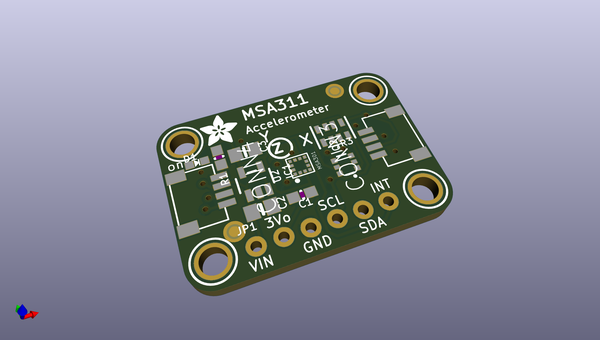
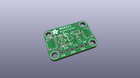
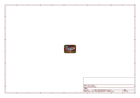
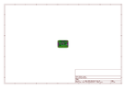
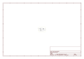

# OOMP Project  
## Adafruit_MSA311_PCB  by adafruit  
  
(snippet of original readme)  
  
-- Adafruit MSA311 Triple Axis Accelerometer PCB  
  
<a href="http://www.adafruit.com/products/5309">   
Click here to purchase one from the Adafruit shop</a>  
  
PCB files for the Adafruit MSA311 Triple Axis Accelerometer.   
  
Format is EagleCAD schematic and board layout  
* https://www.adafruit.com/product/5309  
  
--- Description  
  
The MSA311 is a super small and low-cost triple-axis accelerometer. It's inexpensive, but has just about every 'extra' you'd want in an accelerometer:  
  
* Three-axis sensing, 14-bit resolution  
* ±2g/±4g/±8g/±16g selectable scaling  
* I2C interface on fixed I2C address 0x62  
* Interrupt output  
* Multiple data rate options 1 Hz to 500 Hz  
* As low as 2uA current draw in low power mode (just the chip itself, not including any supporting circuitry)  
* Tap, Double-tap, orientation & freefall detection  
  
The MSA311 is very similar to the MSA301, but is not a drop-in replacement. The I2C address has changed from 0x26 to 0x62!  
  
  
  
--- License  
  
Adafruit invests time and resources providing this open source design, please support Adafruit and open-source hardware by purchasing products from [Adafruit](https://www.adafruit.com)!  
  
Designed by Limor Fried/Ladyada for Adafruit Industries.  
  
Creative Commons Attribution/Share-Alike, all text above must be included in any redistribution.   
See license.txt for additional details.  
  
  full source readme at [readme_src.md](readme_src.md)  
  
source repo at: [https://github.com/adafruit/Adafruit_MSA311_PCB](https://github.com/adafruit/Adafruit_MSA311_PCB)  
## Board  
  
  
## Schematic  
  
  
  
[schematic pdf](working_schematic.pdf)  
## Images  
  
  
  
  
  
  
  
  
  
  
  
  
  
  
  
  
