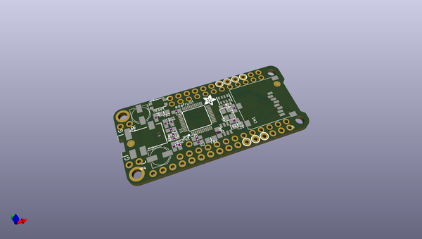
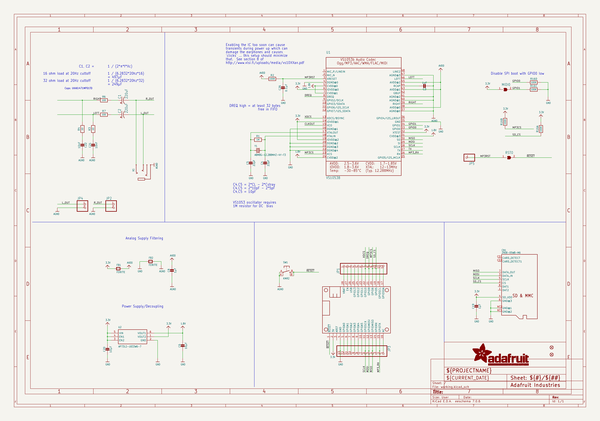
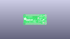
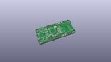
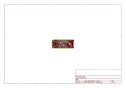
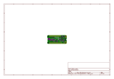
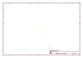
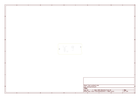
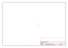
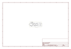

# OOMP Project  
## Adafruit-Music-Maker-FeatherWing-PCB  by adafruit  
  
oomp key: oomp_projects_flat_adafruit_adafruit_music_maker_featherwing_pcb  
(snippet of original readme)  
  
-- Adafruit Music Maker FeatherWing PCB  
  
<a href="http://www.adafruit.com/products/3357">&nbsp;   
<a href="http://www.adafruit.com/products/3436">   
Click a picture to purchase from the Adafruit shop</a>  
  
PCB files for the Adafruit Music Maker FeatherWings. Format is EagleCAD schematic and board layout  
  
For more details, check out the product pages at  
  * Music Maker FeatherWing http://www.adafruit.com/products/3357  
  * Music Maker FeatherWing with 3W amp http://www.adafruit.com/products/3436  
  
--- Description  
  
Bend all audio files to your will with the Adafruit Music Maker FeatherWings! It's a fun-size version of our Music Maker shield for Arduino! This powerful wing features the VS1053, an encoding/decoding (codec) chip that can decode a wide variety of audio formats such as MP3, AAC, Ogg Vorbis, WMA, MIDI, FLAC, WAV (PCM and ADPCM). You can do all sorts of stuff with the audio as well such as adjusting bass, treble, and volume digitally.  
  
All this functionality is implemented in a light-weight SPI interface so that any Feather Board can play audio from an SD card. There's also a special MIDI mode that you can boot the chip into that will read 'classic' 31250Kbaud MIDI data from the UART TX pin and act like a synth/drum machine - there are dozens of built-in drum and sample effects!  
  
What a great musical add-on to your Feather! That's why we spun up this super FeatherWing, p  
  full source readme at [readme_src.md](readme_src.md)  
  
source repo at: [https://github.com/adafruit/Adafruit-Music-Maker-FeatherWing-PCB](https://github.com/adafruit/Adafruit-Music-Maker-FeatherWing-PCB)  
## Board  
  
  
## Schematic  
  
  
  
[schematic pdf](working_schematic.pdf)  
## Images  
  
  
  
  
  
  
  
  
  
  
  
  
  
  
  
  
