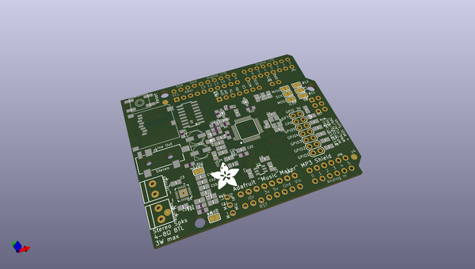
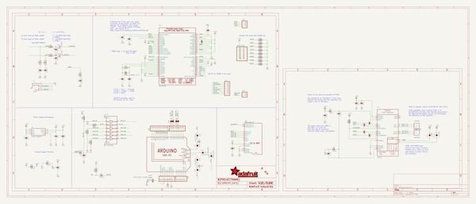
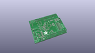
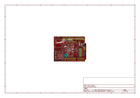
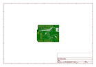
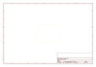
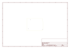
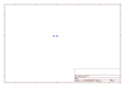
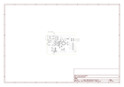

# OOMP Project  
## Adafruit-Music-Maker-MP3-Shield-PCB  by adafruit  
  
oomp key: oomp_projects_flat_adafruit_adafruit_music_maker_mp3_shield_pcb  
(snippet of original readme)  
  
- Adafruit Music Maker MP3 Shields PCB  
  
&nbsp;    
Click to purchase from the Adafruit Shop:  
- [With 3W Amp](https://www.adafruit.com/product/1788)  
- [Without 3W Amp](https://www.adafruit.com/product/1790)  
  
These powerful shields feature the VS1053, an encoding/decoding (codec) chip that can decode a wide variety of audio formats such as MP3, AAC, Ogg Vorbis, WMA, MIDI, FLAC, WAV (PCM and ADPCM). They can also be used to record audio in both PCM (WAV) and compressed Ogg Vorbis. You can do all sorts of stuff with the audio as well such as adjusting bass, treble, and volume digitally.  
  
All this functionality is implemented in a light-weight SPI interface so that any Arduino can play audio from an SD card. There's also a special MIDI mode that you can boot the chip into that will read 'classic' 31250Kbaud MIDI data from an Arduino pin and act like a synth/drum machine - there are dozens of built-in drum and sample effects! But the chip is a pain to solder, and needs a lot of extras. That's why we spun up the best shields, perfect for use with any Adafruit Metro or Arduino Uno, Leonardo or Mega.  
  
There are two versions of the shield: the first has stereo line/headphone output. There is also a version with a 3W/channel class-D stereo speaker amplifier for easy use in projects t  
  full source readme at [readme_src.md](readme_src.md)  
  
source repo at: [https://github.com/adafruit/Adafruit-Music-Maker-MP3-Shield-PCB](https://github.com/adafruit/Adafruit-Music-Maker-MP3-Shield-PCB)  
## Board  
  
  
## Schematic  
  
  
  
[schematic pdf](working_schematic.pdf)  
## Images  
  
  
  
  
  
  
  
  
  
  
  
  
  
  
  
  
