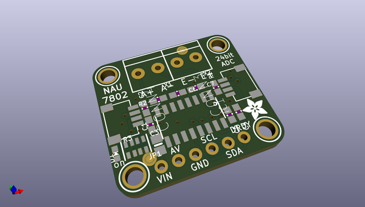
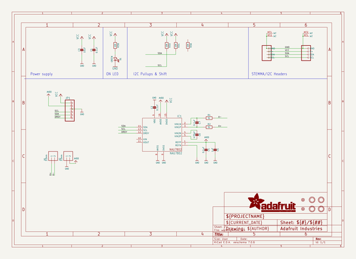
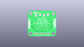
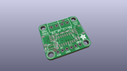
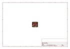
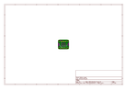
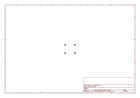
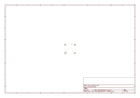
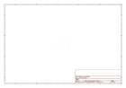
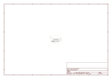

# OOMP Project  
## Adafruit-NAU7802-PCB  by adafruit  
  
(snippet of original readme)  
  
-- Adafruit NAU7802 24-Bit ADC - STEMMA QT / Qwiic PCB  
  
<a href="http://www.adafruit.com/products/4538">   
Click here to purchase one from the Adafruit shop</a>  
  
PCB files for the Adafruit NAU7802 24-Bit ADC - STEMMA QT / Qwiic.   
  
Format is EagleCAD schematic and board layout  
* https://www.adafruit.com/product/4538  
  
--- Description  
  
If you are feeling the stress and strain of modern life a Wheatstone bridge and you want to quantify it, this handy breakout will do the job, no sweat! The Adafruit NAU7802 contains a super-high-resolution 24-Bit differential ADC with extra gain and calibration circuitry that makes it perfect for measuring strain gauges / load cells or other sensors that have four wires that are connected in a Wheatstone bridge arrangement.  
  
Each breakout comes with a NAU7802 ADC chip, plus some support circuitry, and 4 terminal blocks that can be used to connect a 4-wire sensor.  
  
The E- pad connects to ground (often a black wire), the E+ pad connects to a generated voltage from the NAU7802 that can be configured from 2.4V to 4.0V for a solid positive reference (often a red wire).  
  
Then A- and A+ pads connect to the differential outputs from the bridge. For example, connecting to a strain gauge these tend to be the white and green wires.  
  
As the sensor is twisted and bent, the slight changes in resistance are converted to minuscule voltage changes that can be read by the NAU ADC for converting into force or mass  
  full source readme at [readme_src.md](readme_src.md)  
  
source repo at: [https://github.com/adafruit/Adafruit-NAU7802-PCB](https://github.com/adafruit/Adafruit-NAU7802-PCB)  
## Board  
  
  
## Schematic  
  
  
  
[schematic pdf](working_schematic.pdf)  
## Images  
  
  
  
  
  
  
  
  
  
  
  
  
  
  
  
  
