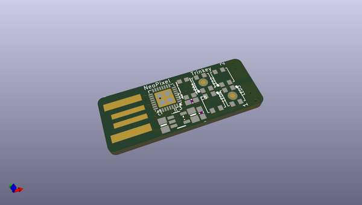
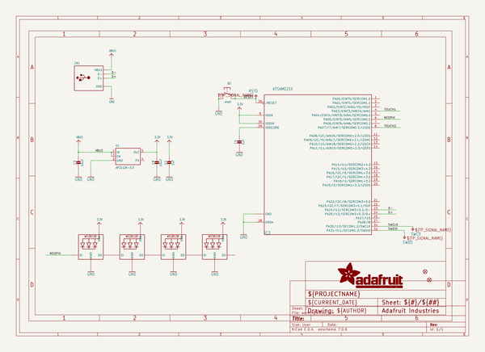
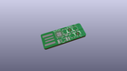
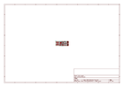
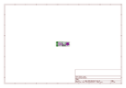
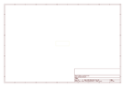
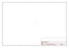
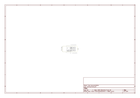

# OOMP Project  
## Adafruit-Neo-Trinkey-PCB  by adafruit  
  
(snippet of original readme)  
  
-- Adafruit Neo Trinkey PCB  
  
<a href="http://www.adafruit.com/products/4870">   
Click here to purchase one from the Adafruit shop</a>  
  
PCB files for the Adafruit Neo Trinkey.   
  
Format is EagleCAD schematic and board layout  
* https://www.adafruit.com/product/4870  
  
--- Description  
  
It's half USB Key, half Adafruit Trinket...it's Neo Trinkey, the circuit board with a Trinket M0 heart and  four RGB NeoPixels for customizable glow. We were inspired by some USB key flashlight boards that would turn any battery pack into an LED torch. So we thought, hey what if we made something like that but with fully programmable color NeoPixels? And this is what we came up with!  
  
The PCB is designed to slip into any USB A port on a computer or laptop. There's an ATSAMD21 microcontroller on board with just enough circuitry to keep it happy. One pin of the microcontroller connects to the four NeoPixel LEDs. Two other pins are used as capacitive touch inputs on the end - if you look carefully you can see the slotted end has left and right touch pads. A reset button lets you enter bootloader mode if necessary. That's it!  
  
The SAMD21 can run CircuitPython or Arduino very nicely - with existing NeoPixel and our FreeTouch libraries for the capacitive touch input. Over the USB connection you can have serial, MIDI or HID connectivity. The Neo Trinkey is perfect for simple projects that can use a few user inputs and colorful outputs. Maybe you'll set it  
  full source readme at [readme_src.md](readme_src.md)  
  
source repo at: [https://github.com/adafruit/Adafruit-Neo-Trinkey-PCB](https://github.com/adafruit/Adafruit-Neo-Trinkey-PCB)  
## Board  
  
  
## Schematic  
  
  
  
[schematic pdf](working_schematic.pdf)  
## Images  
  
  
  
  
  
  
  
  
  
  
  
  
  
  
  
  
