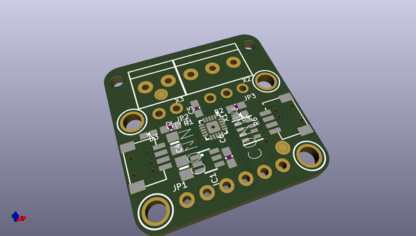
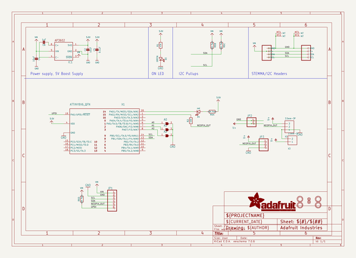
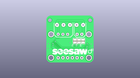
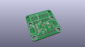
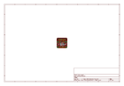
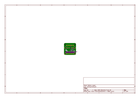
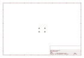
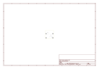
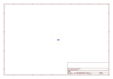

# OOMP Project  
## Adafruit-NeoDriver-STEMMA-QT-PCB  by adafruit  
  
(snippet of original readme)  
  
-- Adafruit NeoDriver - I2C to NeoPixel Driver Board - Stemma QT PCB  
  
<a href="http://www.adafruit.com/products/5766">   
Click here to purchase one from the Adafruit shop</a>  
  
PCB files for the Adafruit NeoDriver - I2C to NeoPixel Driver Board - Stemma QT.   
  
Format is EagleCAD schematic and board layout  
* https://www.adafruit.com/product/5766  
  
--- Description  
  
NeoPixel LEDs (a.k.a WS2812 / SK6812 family) are a super-easy way to add addressable RGB lighting with only one GPIO. They're ubiquitous on microcontrollers, but some chips or single board computers (SBCs) don't have neopixel support due to the precision timing required to send data.  
  
We often get folks asking how to get NeoPixels working on some OrangeBananaOnionRockchipAllWinner Pi type board, given we have our Blinka library that provides support for CircuitPython libraries including the NeoPixel library. But if theres no neopixel_write implementation written for that platform, it just wont work. And writing the neopixel-writer function is non-trivial on many chips: you really need fast GPIO and nanosecond-perfect timing.  
  
A quick solution is this seesaw-based NeoDriver board here: send it the NeoPixel data you want to write over I2C and it will blit out the perfect pixel timing on the other side. We're using an ATtiny1616 so we have enough RAM to buffer a 512-pixel long strand. now, to be fair - its not super fast because we have to write each pixel over I2C, b  
  full source readme at [readme_src.md](readme_src.md)  
  
source repo at: [https://github.com/adafruit/Adafruit-NeoDriver-STEMMA-QT-PCB](https://github.com/adafruit/Adafruit-NeoDriver-STEMMA-QT-PCB)  
## Board  
  
  
## Schematic  
  
  
  
[schematic pdf](working_schematic.pdf)  
## Images  
  
  
  
  
  
  
  
  
  
  
  
  
  
  
  
  
