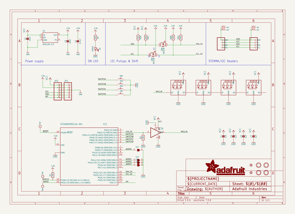

# OOMP Project  
## Adafruit-NeoKey-1x4-PCB  by adafruit  
  
(snippet of original readme)  
  
-- Adafruit NeoKey 1x4 QT I2C PCB  
  
<a href="http://www.adafruit.com/products/4980">   
Click here to purchase one from the Adafruit shop</a>  
  
PCB files for the Adafruit NeoKey 1x4 QT I2C.   
  
Format is EagleCAD schematic and board layout  
* https://www.adafruit.com/product/4980  
  
--- Description  
  
The only thing better than a nice mechanical key is, perhaps, FOUR mechanical keys that also can glow any color of the rainbow - and that's what the Adafruit NeoKey 1x4 QT I2C Breakout will let you do! This longgg 3" x 0.8" PCB fits four Cherry MX or compatible switches and make it easy to use with a breadboard/perfboard or with a STEMMA QT (Qwiic) connector for instant I2C connectivity on any platform.  
  
Please note, each order comes with one assembled and programmed PCB but no switches or keycaps or microcontroller. Most folks have specific key switches and keycaps they want to include, this is just the controller board that plugs into a microcontroller.  
  
The breakout has four Kailh sockets, which means you can plug in any MX-compatible switch instead of soldering it in. You may need a little glue to keep the switch in place: hot glue or a dot of epoxy worked fine for us. Each key also has a reverse-mount NeoPixel pointing up through the spot where many switches would have an LED to shine through.  
  
A microcontroller is pre-programmed with our seesaw firmware so button presses and NeoPixel-controlling is done all over I2C. You can even   
  full source readme at [readme_src.md](readme_src.md)  
  
source repo at: [https://github.com/adafruit/Adafruit-NeoKey-1x4-PCB](https://github.com/adafruit/Adafruit-NeoKey-1x4-PCB)  
## Board  
  
  
## Schematic  
  
  
  
[schematic pdf](working_schematic.pdf)  
## Images  
  
  
  
  
  
  
  
  
  
  
  
  
  
  
  
  
