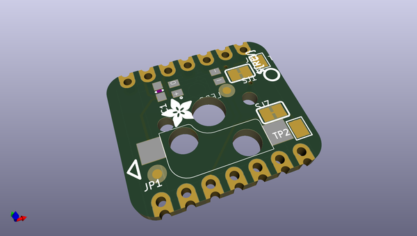
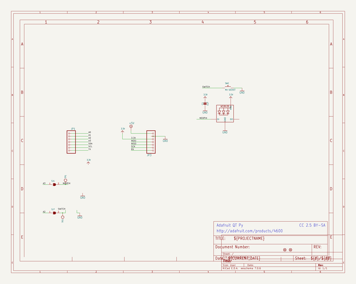
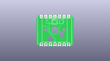
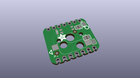
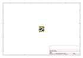
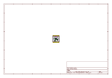
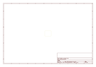
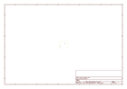
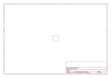
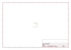

# OOMP Project  
## Adafruit-NeoKey-BFF-PCB  by adafruit  
  
(snippet of original readme)  
  
-- Adafruit NeoKey BFF for Mechanical Key Add-On for QT Py and Xiao - For MX Compatible Switches PCB  
  
<a href="http://www.adafruit.com/products/5695">   
Click here to purchase one from the Adafruit shop</a>  
  
PCB files for the Adafruit NeoKey BFF for Mechanical Key Add-On for QT Py and Xiao - For MX Compatible Switches.   
  
Format is EagleCAD schematic and board layout  
* https://www.adafruit.com/product/5695  
  
--- Description  
  
Our QT Py boards are a great way to make very small microcontroller projects that pack a ton of power - and now we have a way for you to quickly add a nice mechanical key that also can glow any color of the rainbow.   
  
We call this the Adafruit NeoKey BFF - a "Best Friend Forever". When you were a kid you may have learned about the "buddy" system, well this product is kinda like that! A board that will watch your QT Py's back and give it more capabilities.  
  
This PCB is designed to fit onto the back of any QT Py or Xiao board; it can be soldered into place or use pin and socket headers to make it removable. Onboard is a Kailh socket, which means you can plug in any MX-compatible switch instead of soldering it in. You may need a little glue to keep the switch in place: hot glue or a dot of epoxy worked fine for us. Also comes with a single reverse-mount NeoPixel pointing up through the spot where many switches would have an LED to shine through.  
  
We include some header that you can solder to your QT Py. Y  
  full source readme at [readme_src.md](readme_src.md)  
  
source repo at: [https://github.com/adafruit/Adafruit-NeoKey-BFF-PCB](https://github.com/adafruit/Adafruit-NeoKey-BFF-PCB)  
## Board  
  
  
## Schematic  
  
  
  
[schematic pdf](working_schematic.pdf)  
## Images  
  
  
  
  
  
  
  
  
  
  
  
  
  
  
  
  
