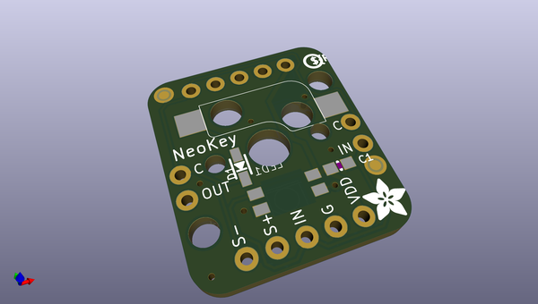
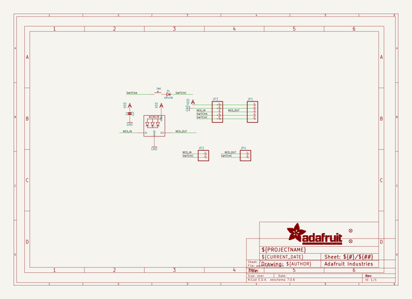
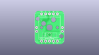
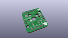
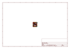
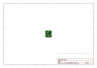
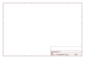
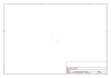
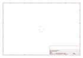
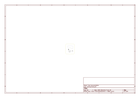

# OOMP Project  
## Adafruit-NeoKey-Breakout-PCB  by adafruit  
  
oomp key: oomp_projects_flat_adafruit_adafruit_neokey_breakout_pcb  
(snippet of original readme)  
  
-- Adafruit NeoKey Breakout with NeoPixel PCB  
  
<a href="http://www.adafruit.com/products/4978">   
Click here to purchase one from the Adafruit shop</a>  
  
PCB files for the Adafruit NeoKey Breakout with NeoPixel.   
  
Format is EagleCAD schematic and board layout  
* https://www.adafruit.com/product/4978  
  
--- Description  
  
The only thing better than a nice mechanical key, is one that also can glow any color of the rainbow - and that's what the Adafruit NeoKey Breakout will let you do! This little 0.75" x 0.85" PCB can fit one Cherry MX or compatible switch and make it easy to use with a breadboard or perfboard.  
  
The breakout has a Kailh socket, which means you can plug in any MX-compatible switch instead of soldering it in. You may need a little glue to keep the switch in place: hot glue or a dot of epoxy worked fine for us. We also place a 1N4148 signal diode in series with the switch, so you can create key-grid matrices without worrying about ghosted keys.  
  
Each breakout also has a single reverse-mount NeoPixel pointing up through the spot where many switches would have an LED to shine though. The input and output of the pixel are broken out so you can 'chain' these board together and control them as one NeoPixel strand.  
  
There's plenty of flexibility for any kind of use, each board has the following pin out:  
  
* VDD (+) The power pin for the NeoPixel, provide 3 to 5VDC  
* GND (-) The ground power pin for the NeoPixel, connect to g  
  full source readme at [readme_src.md](readme_src.md)  
  
source repo at: [https://github.com/adafruit/Adafruit-NeoKey-Breakout-PCB](https://github.com/adafruit/Adafruit-NeoKey-Breakout-PCB)  
## Board  
  
  
## Schematic  
  
  
  
[schematic pdf](working_schematic.pdf)  
## Images  
  
  
  
  
  
  
  
  
  
  
  
  
  
  
  
  
