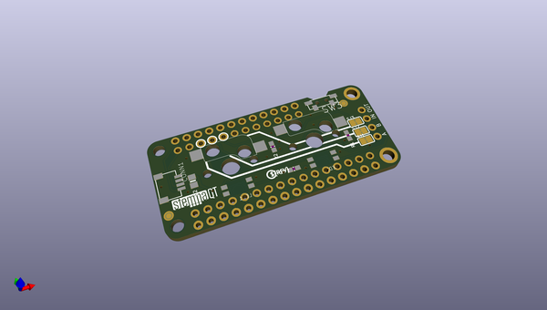
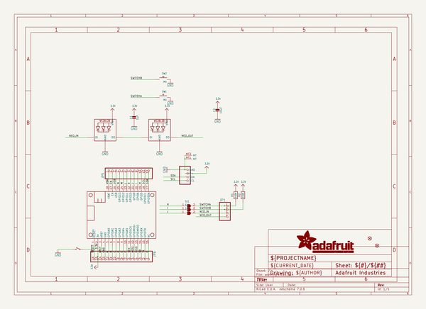
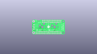
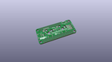
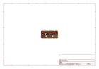
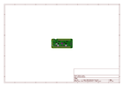
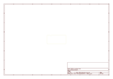
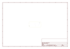
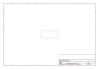
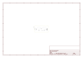

# OOMP Project  
## Adafruit-NeoKey-FeatherWing-PCB  by adafruit  
  
(snippet of original readme)  
  
-- Adafruit NeoKey FeatherWing PCB  
  
<a href="http://www.adafruit.com/products/4979">   
Click here to purchase one from the Adafruit shop</a>  
  
PCB files for the Adafruit NeoKey FeatherWing.   
  
Format is EagleCAD schematic and board layout  
* https://www.adafruit.com/product/4979  
  
--- Description  
  
The only thing better than a nice mechanical key, is two of them, and ones that also can glow any color of the rainbow - and that's what the Adafruit NeoKey FeatherWing will let you do! This Wing plugs into any/all Feather main boards and can fit two Cherry MX or compatible switches to turn your Feather into the lil'est macro keypad.  
  
Each Wing has two Kailh sockets, which means you can plug in any MX-compatible switches instead of soldering them in. You may need a little glue to keep the switches in place: hot glue or a dot of epoxy worked fine for us.  
  
Beneath each switch is a reverse-mount NeoPixel pointing up through the spot where many switches would have an LED to shine though. The two pixels are chained together so you can control them as one 2-pixel NeoPixel strand.  
  
We wired the switches up very simply, so you can use with any Feather. There's jumper pads you can cut to re-wire the switches and LED strand.  
  
* Switch A - Connects to the Feather pin to the left of SCL, on most Feathers this is pin D5  
* Switch B - Connects to the Feather pin two pins to the left of SCL, on most Feathers this is pin D6  
* NeoPixel Input - Connects  
  full source readme at [readme_src.md](readme_src.md)  
  
source repo at: [https://github.com/adafruit/Adafruit-NeoKey-FeatherWing-PCB](https://github.com/adafruit/Adafruit-NeoKey-FeatherWing-PCB)  
## Board  
  
  
## Schematic  
  
  
  
[schematic pdf](working_schematic.pdf)  
## Images  
  
  
  
  
  
  
  
  
  
  
  
  
  
  
  
  
