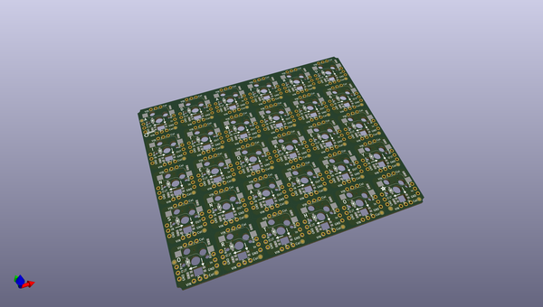
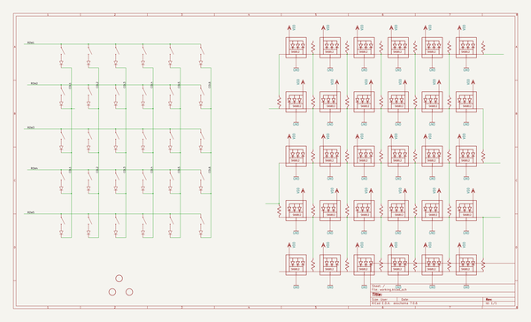
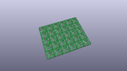
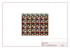
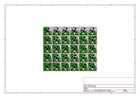
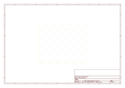
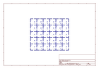
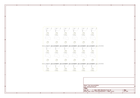

# OOMP Project  
## Adafruit-NeoKey-Snap-Apart-PCB  by adafruit  
  
(snippet of original readme)  
  
-- Adafruit NeoKey Snap-Apart 5x6 Ortho Mechanical Key Switches with NeoPixel PCB  
  
<a href="http://www.adafruit.com/products/5157">   
Click here to purchase one from the Adafruit shop</a>  
  
PCB files for the Adafruit NeoKey Snap-Apart 5x6 Ortho Mechanical Key Switches with NeoPixel.   
  
Format is EagleCAD schematic and board layout  
* https://www.adafruit.com/product/5157  
  
--- Description  
  
For folks who want ready-to-go keeb action, we've got the lovely Adafruit Macropad with a 3x4 grid of MX+NeoPixel key switches - but for those who like to forge their own path, we now present the easiest way of creating custom ortholinear (that's a fancy word for gridded) key matrices. Instead of hand soldering together a custom matrix of NeoKey socket breakouts, the Adafruit NeoKey 5x6 Ortho Snap-Apart Mechanical Key Switches with NeoPixel has 30 key switches that can be snapped apart to make any size grid.  
  
That's right! Even though it comes as 5x6, you can turn it into 2x3, 1x6, 4x3...whatever you wish, and it will work just the way you expect. The little break-apart tabs have traces running through them that pass the power, NeoPixel, and keymatrix lines up and down.  
  
Each 'sub-key' is the same - with a column and row line that is diode protected. For whatever grid size you eventually choose, connect a digital IO pin from your microcontroller to each of the outer rows and columns. With the diode, you don't have to worry about key ghosting.  
  full source readme at [readme_src.md](readme_src.md)  
  
source repo at: [https://github.com/adafruit/Adafruit-NeoKey-Snap-Apart-PCB](https://github.com/adafruit/Adafruit-NeoKey-Snap-Apart-PCB)  
## Board  
  
  
## Schematic  
  
  
  
[schematic pdf](working_schematic.pdf)  
## Images  
  
  
  
  
  
  
  
  
  
  
  
  
  
  
  
  
