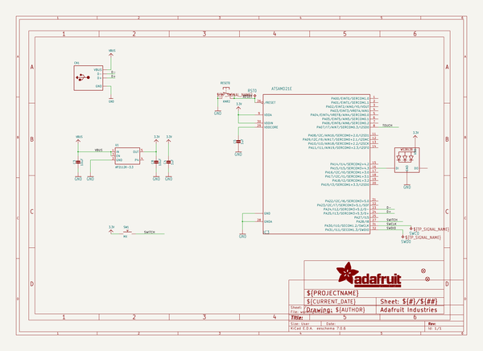

# OOMP Project  
## Adafruit-NeoKey-Trinkey-PCB  by adafruit  
  
oomp key: oomp_projects_flat_adafruit_adafruit_neokey_trinkey_pcb  
(snippet of original readme)  
  
-- Adafruit NeoKey Trinkey PCB  
  
<a href="http://www.adafruit.com/products/5020">   
Click here to purchase one from the Adafruit shop</a>  
  
PCB files for the Adafruit NeoKey Trinkey.   
  
Format is EagleCAD schematic and board layout  
* https://www.adafruit.com/product/5020  
  
--- Description  
  
  
  
It's half USB Key, half Adafruit Trinket, half mechanical keeb...it's NeoKey Trinkey, the circuit board with a Trinket M0 heart, a NeoPixel glow, and a Cherry MX-compatible. We were inspired by single-key macro pads we've seen. So we thought, hey what if we made something like that that plugs right into your computer's USB port, with a fully programmable color NeoPixel? And this is what we came up with!  
  
The PCB is designed to slip into any USB A port on a computer or laptop. There's an ATSAMD21 microcontroller on board with just enough circuitry to keep it happy. One pin of the microcontroller connects to a Cherry MX-compatible switch. Another connects to a NeoPixel LED. The third pin can be used as a capacitive touch input. A reset button lets you enter bootloader mode if necessary. That's it!  
  
The SAMD21 can run CircuitPython or Arduino very nicely - with existing NeoPixel and our FreeTouch libraries for the capacitive touch input. Over the USB connection you can have serial, MIDI or HID connectivity. The NeoKey Trinkey is perfect for simple projects that can use a few user inputs and colorful output. Maybe you'll set it up as a macro-co  
  full source readme at [readme_src.md](readme_src.md)  
  
source repo at: [https://github.com/adafruit/Adafruit-NeoKey-Trinkey-PCB](https://github.com/adafruit/Adafruit-NeoKey-Trinkey-PCB)  
## Board  
  
  
## Schematic  
  
  
  
[schematic pdf](working_schematic.pdf)  
## Images  
  
  
  
  
  
  
  
  
  
  
  
  
  
  
  
  
