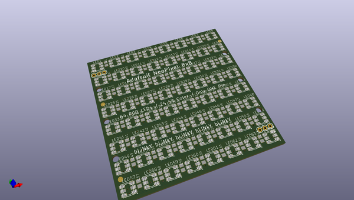
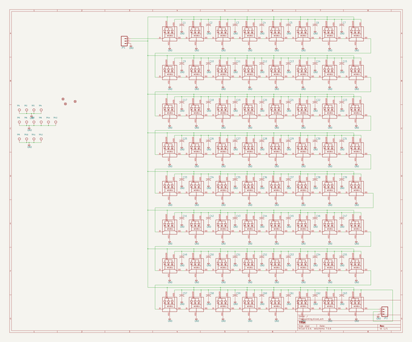
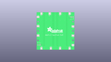
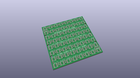
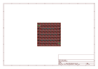
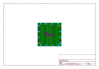
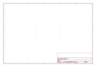
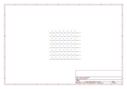

# OOMP Project  
## Adafruit-NeoPixel-8x8-Matrix  by adafruit  
  
(snippet of original readme)  
  
- Adafruit-NeoPixel-8x8-Matrix   
  
__Format is EagleCAD schematic and board layout__  
  
<a href="http://www.adafruit.com/products/1487"> Click here to purchase one from the Adafruit shop</a>  
  
Put on your sunglasses before wiring up this LED matrix - 64 eye-blistering RGB LEDs adorn the NeoMatrix for a blast of configurable color. Arranged in an 8x8 matrix, each pixel is individually addressable. Only one microcontroller pin is required to control all the LEDs, and you get 24 bit color for each LED.  
  
Wiring it up is easy: there are two 3-pin connection ports. Solder wires to the input port and provide 5VDC to the +5V and ground pins, then connect the DIN pin to your microcontroller. If you're using our NeoPixel Arduino library, use digital -6. You'll also need to make a common ground from the 5V power supply to the microcontroller/Arduino. Since each LED can draw as much as 60mA (thats up to 3.5 Amps per panel if all LEDs are on bright white!) we suggest our 5V 2A power supply. For most uses, you'll see about 1-2A of current per panel.  
  
If, say, you need MORE blinky, you can chain these together. For the second shield, connect the DIN connection to the first panel's DOUT. Also connect a ground pin together and power with 5V. There you go! You can chain as many as you'd like although after 4 or more panels you may run low on RAM if you're using an UNO. Watch your power usage too, you may need a 5V 10A power supply for so many o  
  full source readme at [readme_src.md](readme_src.md)  
  
source repo at: [https://github.com/adafruit/Adafruit-NeoPixel-8x8-Matrix](https://github.com/adafruit/Adafruit-NeoPixel-8x8-Matrix)  
## Board  
  
  
## Schematic  
  
  
  
[schematic pdf](working_schematic.pdf)  
## Images  
  
  
  
  
  
  
  
  
  
  
  
  
  
  
  
  
