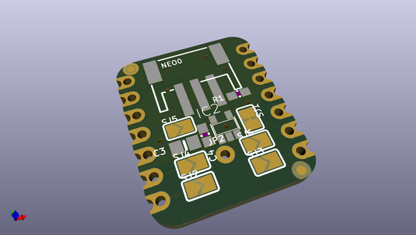
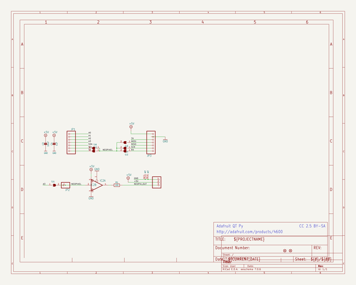
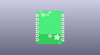
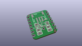
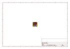
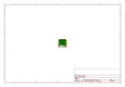
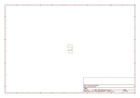

# OOMP Project  
## Adafruit-NeoPixel-Driver-BFF-PCB  by adafruit  
  
oomp key: oomp_projects_flat_adafruit_adafruit_neopixel_driver_bff_pcb  
(snippet of original readme)  
  
-- Adafruit NeoPixel Driver BFF PCB  
  
<a href="http://www.adafruit.com/products/5645">   
Click here to purchase one from the Adafruit shop</a>  
  
PCB files for the Adafruit NeoPixel Driver BFF.   
  
Format is EagleCAD schematic and board layout  
* https://www.adafruit.com/product/5645  
  
--- Description  
  
Our QT Py boards are a great way to make very small microcontroller projects that pack a ton of power - and now we have a way for you to quickly add a strand of NeoPixels with a 5V level shifter and a detachable JST PH connector. It's an excellent way to make tiny wearable, cosplay or IoT projects with dazzling LEDs.  
  
We call this the Adafruit NeoPixel Driver BFF - a "Best Friend Forever". When you were a kid you may have learned about the "buddy" system, well this product is kinda like that! A board that will watch your QT Py's back and give it the power and support to drive NeoPixel strips, rings, and panels.  
  
This PCB is designed to fit onto the back of any QT Py or Xiao board, it can be soldered into place or use pin and socket headers to make it removable. Onboard is a 74AHCT125 single-gate level shifter that will take pin A3's output, and shift it up to 5V using the USB power as a reference. The USB power, ground and shifted data is then piped out to a JST PH 2mm 3-pin connector.  
  
If using one of our NeoPixel strips with a JST-PH connector on them already, you can just plug it right in for instant lights. If you're using a   
  full source readme at [readme_src.md](readme_src.md)  
  
source repo at: [https://github.com/adafruit/Adafruit-NeoPixel-Driver-BFF-PCB](https://github.com/adafruit/Adafruit-NeoPixel-Driver-BFF-PCB)  
## Board  
  
  
## Schematic  
  
  
  
[schematic pdf](working_schematic.pdf)  
## Images  
  
  
  
  
  
  
  
  
  
  
  
  
  
  
  
  
