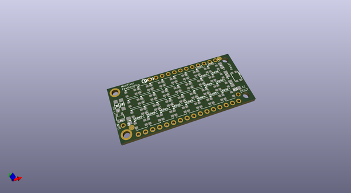
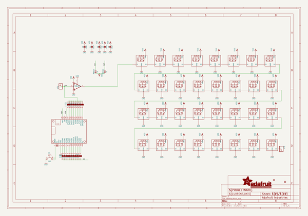
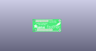
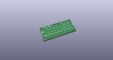
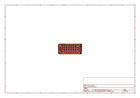
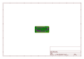
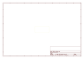
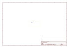
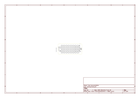

# OOMP Project  
## Adafruit-NeoPixel-FeatherWing-PCB  by adafruit  
  
oomp key: oomp_projects_flat_adafruit_adafruit_neopixel_featherwing_pcb  
(snippet of original readme)  
  
-- Adafruit NeoPixel FeatherWing PCB  
<a href="http://www.adafruit.com/products/2945">   
Click here to purchase one from the Adafruit shop</a>  
  
This is the NeoPixel FeatherWing, a 4x8 RGB LED Add-on For All Feather Boards! Using our Feather Stacking Headers or Feather Female Headers you can connect a FeatherWing on top or bottom of your Feather board and make your Feather board strut like a peacock at a rave.  
  
Put on your sunglasses before staring into these 32 configurable eye-blistering RGB LEDs. Arranged in a 4x8 matrix, each pixel is individually addressable. Only one pin is required to control all the LEDs. On the bottom we have jumpers for the DIN line to any of the I/O pins on a Feather.  Works with any/all of our Feathers! You can cut the default jumper trace and use any pin you like. (In particular, the default pin for Feather Huzzah ESP8266 must be moved, try pin -15!) It works with but is not recommended for ESP32 Feather at this time due to a NeoPixel timing issue that makes it hard to control more than 30 pixels  
  
PCB files for the Adafruit NeoPixel FeatherWing. The format is EagleCAD schematic and board layout  
- http://www.adafruit.com/products/2945  
  
--- License  
  
Adafruit invests time and resources providing this open source design, please support Adafruit and open-source hardware by purchasing products from [Adafruit](https://www.adafruit.com)!  
  
All text above must be included in any redistribution  
  
Designed b  
  full source readme at [readme_src.md](readme_src.md)  
  
source repo at: [https://github.com/adafruit/Adafruit-NeoPixel-FeatherWing-PCB](https://github.com/adafruit/Adafruit-NeoPixel-FeatherWing-PCB)  
## Board  
  
  
## Schematic  
  
  
  
[schematic pdf](working_schematic.pdf)  
## Images  
  
  
  
  
  
  
  
  
  
  
  
  
  
  
  
  
