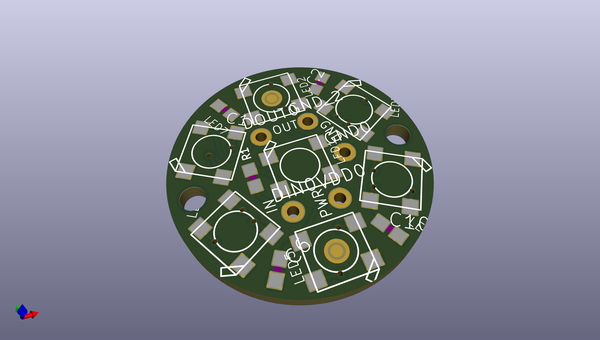
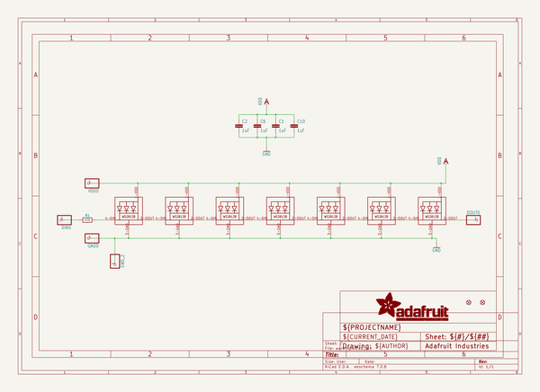
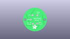
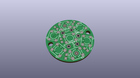
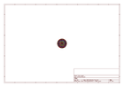
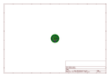
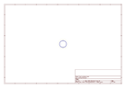
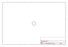

# OOMP Project  
## Adafruit-NeoPixel-Jewel-7  by adafruit  
  
oomp key: oomp_projects_flat_adafruit_adafruit_neopixel_jewel_7  
(snippet of original readme)  
  
- Adafruit NeoPixel Jewel containing 7 NeoPixels  
  
<a href="http://www.adafruit.com/products/2226">   
Click here to purchase one from the Adafruit shop</a>  
  
We fit seven of our tiny 5050 (5mm x 5mm) smart RGB LEDs onto a beautiful, round PCB with mounting holes and a chainable design to create what we think is our most elegant (and evening-wear appropriate) NeoPixel board yet.  
  
Use only one microcontroller pin to control as many as you can chain together! Each LED is addressable as the driver chip is inside the LED. Each one has ~18mA constant current drive so the color will be very consistent even if the voltage varies, and no external choke resistors are required making the design slim. Power the whole thing with 5VDC and you're ready to rock.  
  
PCB files for Adafruit NeoPixel Jewel with 7 NeoPixel LEDs  
  
For more details, check out the product page at  
  
-----> https://www.adafruit.com/product/2226  
  
--- License  
  
Adafruit invests time and resources providing this open source design, please support Adafruit and open-source hardware by purchasing products from [Adafruit](https://www.adafruit.com)!  
  
All text above must be included in any redistribution  
  
Designed by Limor Fried/Ladyada for Adafruit Industries.  
Creative Commons Attribution/Share-Alike, all text above must be included in any redistribution.   
See license.txt for additional information.  
  
  full source readme at [readme_src.md](readme_src.md)  
  
source repo at: [https://github.com/adafruit/Adafruit-NeoPixel-Jewel-7](https://github.com/adafruit/Adafruit-NeoPixel-Jewel-7)  
## Board  
  
  
## Schematic  
  
  
  
[schematic pdf](working_schematic.pdf)  
## Images  
  
  
  
  
  
  
  
  
  
  
  
  
  
  
  
  
