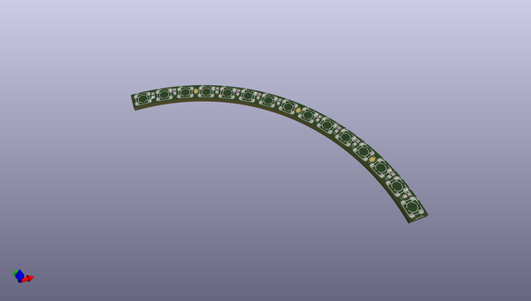
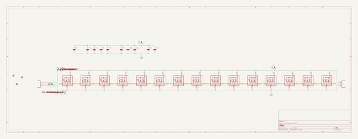
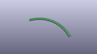
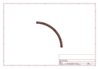
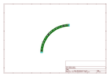
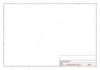
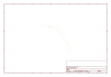
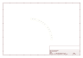

# OOMP Project  
## Adafruit-NeoPixel-Ring  by adafruit  
  
oomp key: oomp_projects_flat_adafruit_adafruit_neopixel_ring  
(snippet of original readme)  
  
- Adafruit 12, 16, and 24 NeoPixel Rings  
  
&nbsp;   
&nbsp;   
   
  
Buy these products in the Adafruit Shop:  
  
- [16 NeoPixel Ring](http://www.adafruit.com/products/1463)  
- [24 NeoPixel Ring](http://www.adafruit.com/products/1586)  
- [12 NeoPixel Ring](http://www.adafruit.com/products/1643)  
  
These ultra bright smart LED NeoPixels are arranged in a circle. The rings are 'chainable' - connect the output pin of one to the input pin of another. Use only one microcontroller pin to control as many as you can chain together! Each LED is addressable as the driver chip is inside the LED. Each one has ~18mA constant current drive so the color will be very consistent even if the voltage varies, and no external choke resistors are required making the design slim. Power the whole thing with 5VDC (4-7V works) and you're ready to rock.  
  
There is a single data line with a very timing-specific protocol. Since the protocol is very sensitive to timing, it requires a real-time microconroller such as an AVR, Adafruit Metro/Trinket/Gemma, Arduino, etc. It cannot be used with a Linux-based microcomputer or interpreted microcontroller such as the Raspberry Pi, netduino or Basic Stamp. Our wonderfully-wr  
  full source readme at [readme_src.md](readme_src.md)  
  
source repo at: [https://github.com/adafruit/Adafruit-NeoPixel-Ring](https://github.com/adafruit/Adafruit-NeoPixel-Ring)  
## Board  
  
  
## Schematic  
  
  
  
[schematic pdf](working_schematic.pdf)  
## Images  
  
  
  
  
  
  
  
  
  
  
  
  
  
  
  
  
