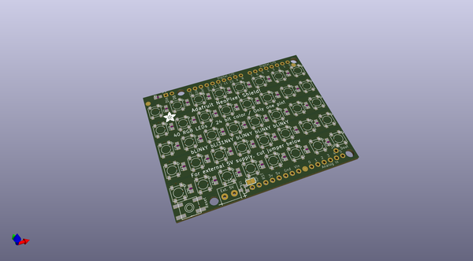
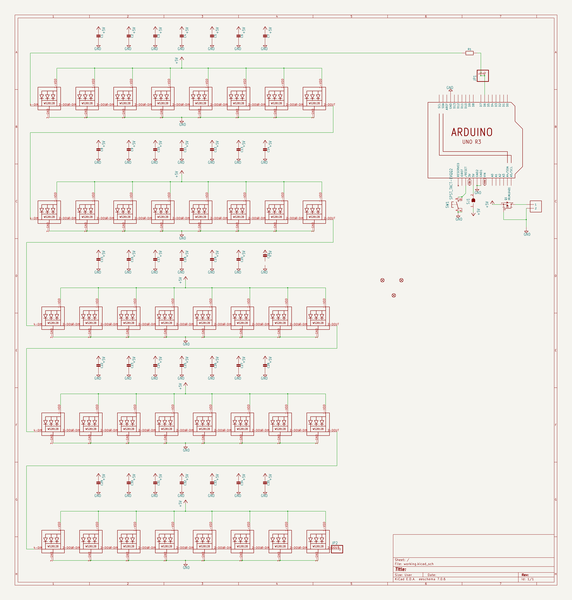
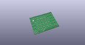
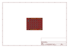
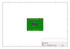
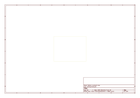
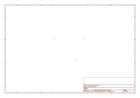
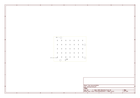

# OOMP Project  
## Adafruit-NeoPixel-Shield-PCB  by adafruit  
  
oomp key: oomp_projects_flat_adafruit_adafruit_neopixel_shield_pcb  
(snippet of original readme)  
  
-- Adafruit NeoPixel Shield for Arduino - 40 RGB LED Pixel Matrix PCB  
  
<a href="http://www.adafruit.com/products/1430">   
Click here to purchase one from the Adafruit shop</a>  
  
PCB files for the Adafruit NeoPixel Shield for Arduino - 40 RGB LED Pixel Matrix. Format is EagleCAD schematic and board layout  
* https://www.adafruit.com/product/1430  
  
--- Description  
  
Put on your sunglasses before putting this shield onto your 'duino - 40 eye-blistering RGB LEDs adorn the NeoPixel shield for a blast of configurable color. Arranged in a 5x8 matrix, each pixel is individually addressable. Only one pin (Digital -6) is required to control all the LEDs. You can cut a trace and use nearly any other pin if you need some customization.  
  
To make it easy to start, the LEDs are by default powered from the 5V onboard Arduino supply. As long as you aren't lighting up all the pixels full power white that should be fine. If you want to power the shield with an external power supply, solder in the included terminal block (pro-tip: put it on the bottom of the board so it doesn't stick up) to wire in an external 4-6VDC power supply - that power supply will also power the Arduino and shield. If you want to use the terminal block to power the shield but keep the Arduino itself on DC or USB power only, cut the center of the solder jumper to the right of the terminal block. There's a polarity protection FET on the external input in case you wire the pow  
  full source readme at [readme_src.md](readme_src.md)  
  
source repo at: [https://github.com/adafruit/Adafruit-NeoPixel-Shield-PCB](https://github.com/adafruit/Adafruit-NeoPixel-Shield-PCB)  
## Board  
  
  
## Schematic  
  
  
  
[schematic pdf](working_schematic.pdf)  
## Images  
  
  
  
  
  
  
  
  
  
  
  
  
  
  
  
  
