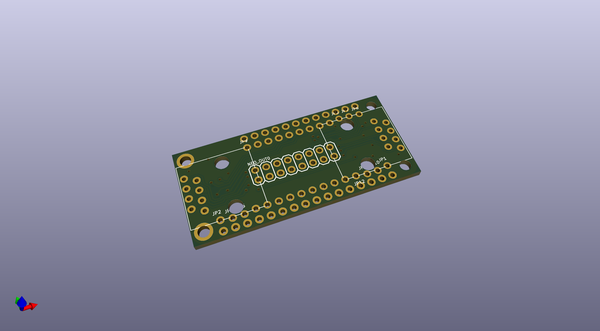
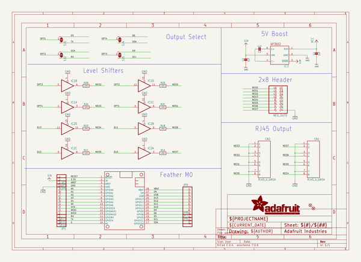
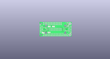
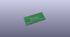
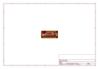
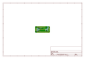
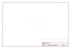
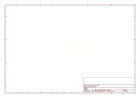
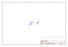
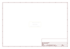

# OOMP Project  
## Adafruit-NeoPXL8-PCBs  by adafruit  
  
oomp key: oomp_projects_flat_adafruit_adafruit_neopxl8_pcbs  
(snippet of original readme)  
  
-- Adafruit NeoPXL8 Friend and FeatherWing PCB  
  
<a href="http://www.adafruit.com/products/3249">  
<a href="http://www.adafruit.com/products/3975">   
Click here to purchase one from the Adafruit shop</a>  
  
PCB files for the Adafruit NeoPXL8 Friend and FeatherWings.  
  
Format is EagleCAD schematic and board layout  
* https://www.adafruit.com/product/3975 (friend)  
* https://www.adafruit.com/product/3249 (M0 wing)  
* https://www.adafruit.com/product/4537 (M4 wing)  
  
--- Description  
  
Since we first started carrying NeoPixels back in 2012, the chainable RGB LEDs have taken over the world. And a big part of that success is due to the simplicity of their wiring - just one data wire, no matter how many pixels you've got. So no surprise they're everywhere, blinking away in art exhibits, maker faire demos, DJ booths, decorations and costumes.  
  
But, at some point, every NeoPixel'er bumps into the constraints of that single-data-wire: the timing is very picky and often time your code has to stop completely so that it can burst out the data without any interruptions. This requirement makes it tough to create fast-update lighting effects, and limits the number of pixels you can drive before other hardware peripherals get attention.  
  
Resident pixel-pro Paint Your Dragon (who coined the name NeoPixel dont-cha-know!) took on this challenge and has succeeded gloriously. By carefully examining the ATS  
  full source readme at [readme_src.md](readme_src.md)  
  
source repo at: [https://github.com/adafruit/Adafruit-NeoPXL8-PCBs](https://github.com/adafruit/Adafruit-NeoPXL8-PCBs)  
## Board  
  
  
## Schematic  
  
  
  
[schematic pdf](working_schematic.pdf)  
## Images  
  
  
  
  
  
  
  
  
  
  
  
  
  
  
  
  
