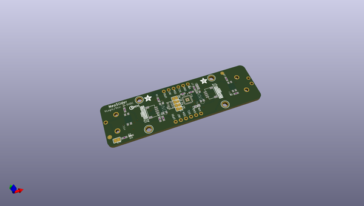
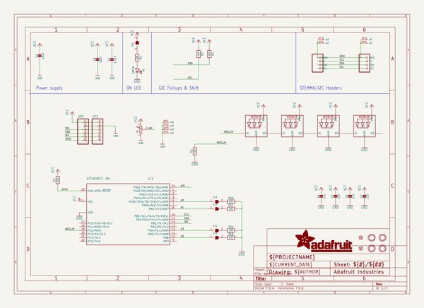
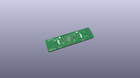
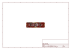
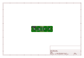
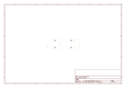
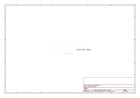
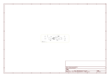

# OOMP Project  
## Adafruit-NeoSlider-PCB  by adafruit  
  
(snippet of original readme)  
  
-- Adafruit NeoSlider I2C QT Slide Potentiometer with 4 NeoPixels - STEMMA QT/QWIIC PCB  
  
<a href="http://www.adafruit.com/products/5295">   
Click here to purchase one from the Adafruit shop</a>  
  
PCB files for the Adafruit NeoSlider I2C QT Slide Potentiometer with 4 NeoPixels - STEMMA QT/QWIIC.   
  
Format is EagleCAD schematic and board layout  
* https://www.adafruit.com/product/5295  
  
--- Description  
  
Our family of I2C-friendly user interface elements grows by one with this new product that makes it plug-n-play-easy to add a 75mm long slide potentiometer to any microcontroller or microcomputer with an I2C port.  
  
Each breakout is 3" long and 0.8" wide, with a single linear slide pot in the center. Underneath, there are four under-lighting NeoPixels that can display any RGB color. In the middle, a small microcontroller takes I2C commands and converts them to analog reads (of the potentiometer) and NeoPixel control. Goes great with our Stemma QT rotary encoder and 1x4 NeoKey QT breakout.  
  
Thanks to the Stemma QT / Qwiic connectors underneath, you can easily connect using QT cables - no soldering required! There's even four I2C selection jumpers that you can cut to change the address from the default 0x30 to any value up to 0x3F so up to 16 slide pots can all share one chained cable.  
  
To get you going fast, we spun up a custom-made PCB with the seesaw chip and all supporting circuitry for 3 or 5V power and logic. The STEMMA QT conn  
  full source readme at [readme_src.md](readme_src.md)  
  
source repo at: [https://github.com/adafruit/Adafruit-NeoSlider-PCB](https://github.com/adafruit/Adafruit-NeoSlider-PCB)  
## Board  
  
  
## Schematic  
  
  
  
[schematic pdf](working_schematic.pdf)  
## Images  
  
  
  
  
  
  
  
  
  
  
  
  
  
  
  
  
