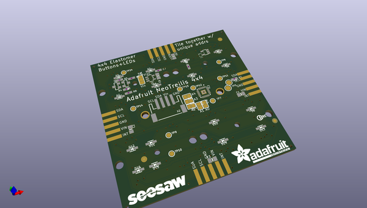
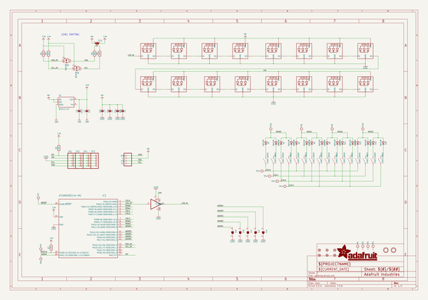
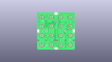
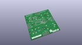
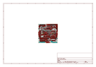
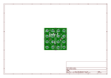
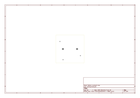
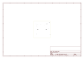
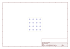
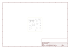

# OOMP Project  
## Adafruit-NeoTrellis-4x4-PCB  by adafruit  
  
(snippet of original readme)  
  
-- Adafruit NeoTrellis RGB Driver PCB for 4x4 Keypad PCB  
  
<a href="http://www.adafruit.com/products/3954">   
Click here to purchase one from the Adafruit shop</a>  
  
PCB files for the Adafruit NeoTrellis RGB Driver PCB for 4x4 Keypad. Format is EagleCAD schematic and board layout  
* https://www.adafruit.com/product/3954  
  
--- Description  
  
By popular request, we've upgraded our popular Trellis elastomer button kits to now have a PCB with full color NeoPixel support! You heard that right, no more single-color LEDs, you can now have any color you like under the fantastic rubbery button pads we sell.  
  
These 4x4 button pad boards are fully tile-able and communicate over I2C. With 5 address pins, you've got the ability to connect up to 32 together in any arrangement you like. [With our trusty seesaw I2C-to-anything chip](https://learn.adafruit.com/adafruit-seesaw-atsamd09-breakout), you don't even need to manage the NeoPixel driving. That's right! Both the button management and LED driving is completely handled for you all over plain I2C. With both Arduino/C++ and CircuitPython/Python library support, you can use these pads with any and all microcontroller or computer boards.  
  
Perfect for your next cool interface, MIDI instrument, control panel...whatever could benefit from beautiful diffused colorful buttons. For fast connection to a single board, we include a JST-PH 4-pin connector that will give you power+data access. It's Grove c  
  full source readme at [readme_src.md](readme_src.md)  
  
source repo at: [https://github.com/adafruit/Adafruit-NeoTrellis-4x4-PCB](https://github.com/adafruit/Adafruit-NeoTrellis-4x4-PCB)  
## Board  
  
  
## Schematic  
  
  
  
[schematic pdf](working_schematic.pdf)  
## Images  
  
  
  
  
  
  
  
  
  
  
  
  
  
  
  
  
