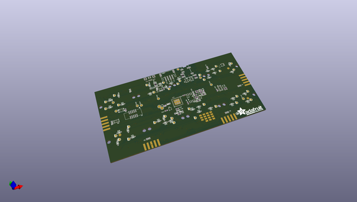

# OOMP Project  
## Adafruit-NeoTrellis-M4-PCB-and-Enclosure  by adafruit  
  
oomp key: oomp_projects_flat_adafruit_adafruit_neotrellis_m4_pcb_and_enclosure  
(snippet of original readme)  
  
- Adafruit-NeoTrellis-M4-PCB-and-Enclosure  
CAD files for the Adafruit NeoTrellis M4 PCB and Enclosure  
  
PCB format is EagleCAD schematic and board layout  
Enclosure format is Illustrator, cut from 3mm Acrylic  
  
For more details, check out the product pages at  
  
   * https://www.adafruit.com/product/4020  
   * https://www.adafruit.com/product/3938  
   * https://www.adafruit.com/product/3963  
  
Adafruit invests time and resources providing this open source design,   
please support Adafruit and open-source hardware by purchasing   
products from Adafruit!  
  
Designed by Adafruit Industries.    
Creative Commons Attribution, Share-Alike license, check license.txt for more information  
All text above must be included in any redistribution  
  full source readme at [readme_src.md](readme_src.md)  
  
source repo at: [https://github.com/adafruit/Adafruit-NeoTrellis-M4-PCB-and-Enclosure](https://github.com/adafruit/Adafruit-NeoTrellis-M4-PCB-and-Enclosure)  
## Board  
  
  
## Schematic  
  
  
  
[schematic pdf](working_schematic.pdf)  
## Images  
