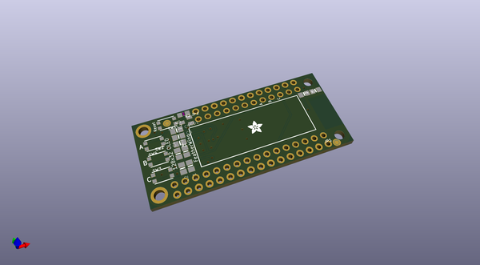
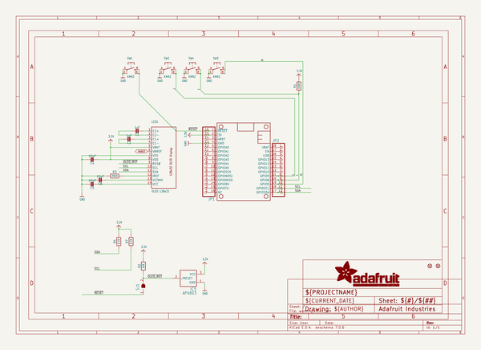
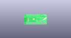
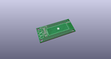
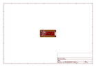
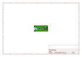
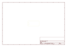
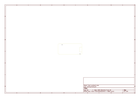
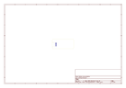
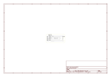

# OOMP Project  
## Adafruit-OLED-FeatherWing-PCB  by adafruit  
  
(snippet of original readme)  
  
-- Adafruit FeatherWing OLED - 128x32 and 128x64 OLED Add-on For Feather PCB  
<a href="http://www.adafruit.com/products/2900">   
<a href="http://www.adafruit.com/products/2900">   
Click here to purchase one from the Adafruit shop</a>  
  
PCB files for the Adafruit FeatherWing OLED - 128x32 OLED Add-on For Feather. Format is EagleCAD schematic and board layout  
* https://www.adafruit.com/product/2900  
  
and for Adafruit FeatherWing OLED - 128x64 OLED Add-on For Feather - STEMMA QT / Qwiic  
* https://www.adafruit.com/product/4650  
  
--- Description  
  
A Feather board without ambition is a Feather board without FeatherWings! This is the **FeatherWing OLED**: it adds a 128x32 or 128x64 monochrome OLED plus 3 user buttons to any Feather main board. Using our [Feather Stacking Headers](https://www.adafruit.com/products/2830) or [Feather Female Headers](http://www.adafruit.com/products/2886) you can connect a FeatherWing on top of your Feather board and let the board take flight!  
  
These displays are small, only about 1"-1.3" diagonal, but very readable due to the high contrast of an OLED display. This screen is made of 128x32 individual white OLED pixels and because the display makes its own light, no backlight is required. This reduces the power required to run the OLED and is why the display has such high contrast; we really like this miniature display for its crispness! We also toss on a  
  full source readme at [readme_src.md](readme_src.md)  
  
source repo at: [https://github.com/adafruit/Adafruit-OLED-FeatherWing-PCB](https://github.com/adafruit/Adafruit-OLED-FeatherWing-PCB)  
## Board  
  
  
## Schematic  
  
  
  
[schematic pdf](working_schematic.pdf)  
## Images  
  
  
  
  
  
  
  
  
  
  
  
  
  
  
  
  
