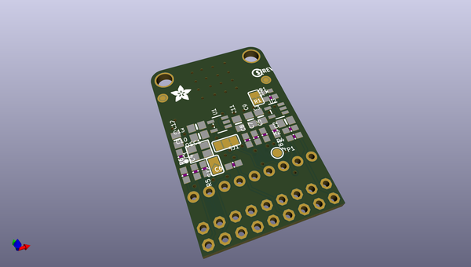
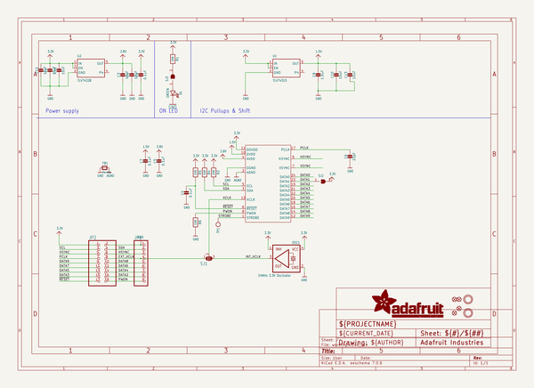
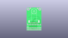
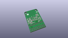
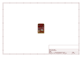
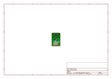
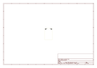
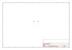
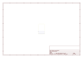
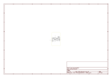

# OOMP Project  
## Adafruit-OV5640-Camera-Breakout-PCB  by adafruit  
  
(snippet of original readme)  
  
-- Adafruit OV5640 Camera Breakout - 120 Degree Lens PCB  
  
<a href="http://www.adafruit.com/products/5673">   
Click here to purchase one from the Adafruit shop</a>  
  
PCB files for the Adafruit OV5640 Camera Breakout - 120 Degree Lens.   
  
Format is EagleCAD schematic and board layout  
* https://www.adafruit.com/product/5673  
  
--- Description  
  
Hobby-level microcontrollers are finally getting big and powerful enough to start handling camera modules that historically would have required a full computer or FPGA to handle. The RP2040 and ESP32-Sx series of chips, for example, have enough pins to communicate with the 8-bit data output, DMA to quickly grab a frame, and the necessary RAM to buffer a raw snapshot. Now all we need is a nice camera module to make interfacing easy!  
  
This Adafruit OV5640 Camera Breakout with 120 Degree Lens has a nice quality OV5640 camera with a 5 Megapixel sensor element, 120-degree wide angle lens, and all the support circuitry you need. We looked at existing camera modules and while this breakout board is backwards compatible, we made some improvements:  
  
* Standard 2x9 header if you want it, but also a duplicated header strip 0.3" apart so you can plug it into a breadboard or perfboard   
* Selectable external or internal 24MHz "XCLK" clock generation - save one gpio pin, or just have a nice stable 24 MHz signal even if your microcontroller can't generate it for you.  
* Heat-sinking camera area with expos  
  full source readme at [readme_src.md](readme_src.md)  
  
source repo at: [https://github.com/adafruit/Adafruit-OV5640-Camera-Breakout-PCB](https://github.com/adafruit/Adafruit-OV5640-Camera-Breakout-PCB)  
## Board  
  
  
## Schematic  
  
  
  
[schematic pdf](working_schematic.pdf)  
## Images  
  
  
  
  
  
  
  
  
  
  
  
  
  
  
  
  
