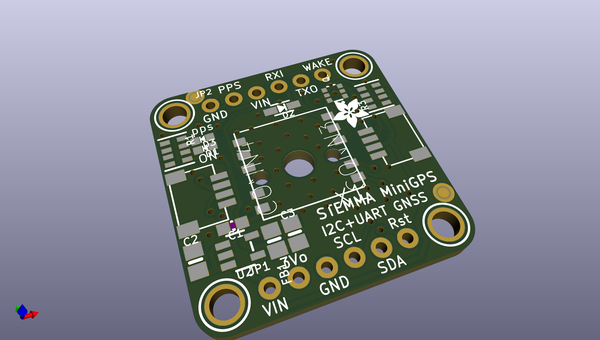
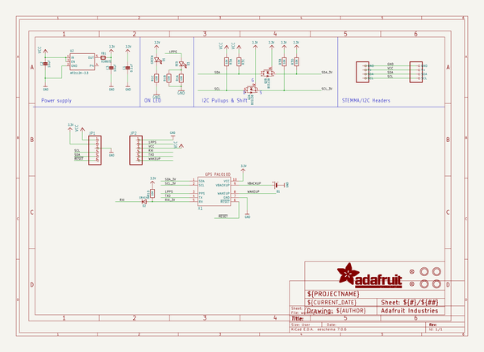
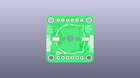
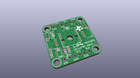
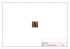
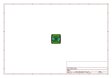
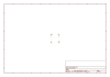
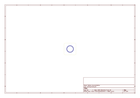
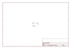

# OOMP Project  
## Adafruit-PA1010D-Mini-GPS-PCB  by adafruit  
  
oomp key: oomp_projects_flat_adafruit_adafruit_pa1010d_mini_gps_pcb  
(snippet of original readme)  
  
-- Adafruit PA1010D Mini GPS Module PCB  
  
<a href="http://www.adafruit.com/products/4415">   
Click here to purchase one from the Adafruit shop</a>  
  
PCB files for the Adafruit PA1010D Mini GPS Module.   
  
Format is EagleCAD schematic and board layout  
* https://www.adafruit.com/product/4415  
  
--- Description  
  
This miniature GPS breakout is only 1" x 1" (~ 25mm x 25mm) but houses a complete GPS/GNSS solution with both I2C and UART interfaces. There's even an antenna on top so it's plug and play!  
  
* Support for GPS, GLONASS, GALILEO, QZSS  
* -165 dBm sensitivity, up to 10 Hz updates  
* Up to 210 PRN channels with 99 search channels and 33 simultaneous tracking channels  
* 5V friendly design and only 30mA current draw  
* Breadboard-able, with 4 mounting holes  
* UART and I2C interfaces, pick whichever you like most!  
* RTC battery-compatible  
* PPS output on fix ±20ns jitter  
* Internal patch antenna  
* Low-power and standby mode with WAKE pin  
  
The breakout is built around the MTK3333 chipset, a reliable, high-quality GPS module that can handle up to 33 simultaneous tracking channels, has an excellent high-sensitivity receiver (-165 dBm tracking!), and a built in antenna. It can do up to 10 location updates a second for high speed, high sensitivity logging or tracking. Power usage is incredibly low, only 30 mA during navigation.  
  
Best of all, we added all the extra goodies you could ever want: a ultra-low dropout 3.3V regulator so you can po  
  full source readme at [readme_src.md](readme_src.md)  
  
source repo at: [https://github.com/adafruit/Adafruit-PA1010D-Mini-GPS-PCB](https://github.com/adafruit/Adafruit-PA1010D-Mini-GPS-PCB)  
## Board  
  
  
## Schematic  
  
  
  
[schematic pdf](working_schematic.pdf)  
## Images  
  
  
  
  
  
  
  
  
  
  
  
  
  
  
  
  
