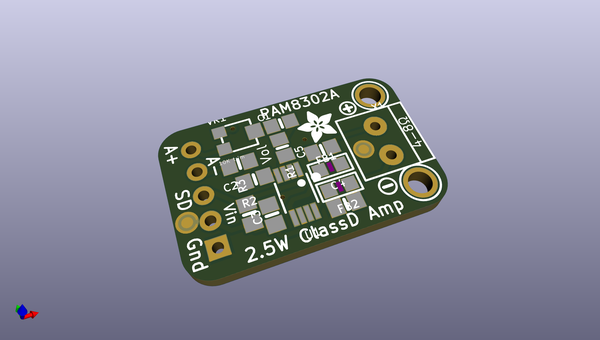
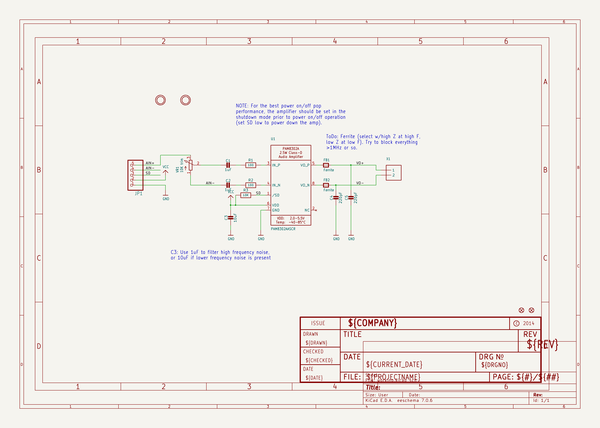
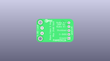
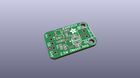
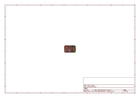
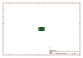
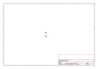
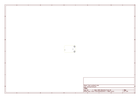
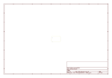
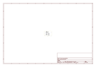

# OOMP Project  
## Adafruit-PAM8302-Mono-Amplifier-PCB  by adafruit  
  
(snippet of original readme)  
  
-- Adafruit PAM8302 Mono Amplifier PCB  
<a href="http://www.adafruit.com/products/2130">   
Click here to purchase one from the Adafruit shop</a>  
  
This super small mono amplifier is surprisingly powerful - able to deliver up to 2.5 Watts into 4-8 ohm impedance speakers. Inside the miniature chip is a class D controller, able to run from 2.0V-5.5VDC. Since the amp is a class D, its very efficient (over 90% efficient when driving an 8Ω speaker at over half a Watt) - making it perfect for portable and battery-powered projects. It has built in thermal and over-current protection but we could barely tell it got hot. There's even a volume trim pot so you can adjust the volume on the board down from the default 24dB gain. This board is a welcome upgrade to basic "LM386" amps!  
  
The A+ and A- inputs of the amplifier go through 1.0uF capacitors, so they are fully 'differential' - if you don't have differential outputs, simply tie the Audio- pin  to ground. The output is "Bridge Tied" - that means the output pins connect directly to the speaker pins, no connection to ground. The output is a high frequency 250KHz square wave PWM that is then 'averaged out' by the speaker coil - the high frequencies are not heard. All the above means that you can't connect the output into another amplifier, it should drive the speakers directly.  
  
Comes with a fully assembled and tested breakout board. We also include header to plug it into a breadboard a  
  full source readme at [readme_src.md](readme_src.md)  
  
source repo at: [https://github.com/adafruit/Adafruit-PAM8302-Mono-Amplifier-PCB](https://github.com/adafruit/Adafruit-PAM8302-Mono-Amplifier-PCB)  
## Board  
  
  
## Schematic  
  
  
  
[schematic pdf](working_schematic.pdf)  
## Images  
  
  
  
  
  
  
  
  
  
  
  
  
  
  
  
  
