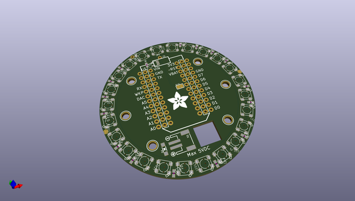
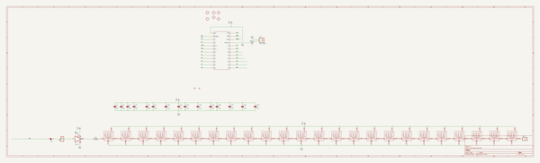
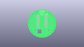
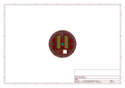
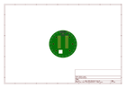
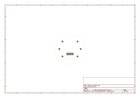
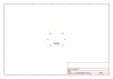
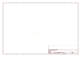
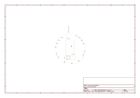

# OOMP Project  
## Adafruit-Particle-Spark-Neopixel-Ring-PCB  by adafruit  
  
(snippet of original readme)  
  
-- Adafruit Particle Spark Neopixel Ring PCB  
<a href="http://www.adafruit.com/products/2268">   
Click here to purchase one from the Adafruit shop</a>  
  
Add some dazzle to your Spark Core or Photon with this custom-made NeoPixel ring kit! 24 ultra bright smart LED NeoPixels are arranged in a circle with 2.6" (66mm) outer diameter. Snap in your Spark and upload the NeoPixel library code to light up the LEDs, make an Internet of Blinky! Each LED is addressable as the driver chip is inside the LED. Each one has ~18mA constant current drive so the color will be very consistent even if the voltage varies, and no external choke resistors are required making the design slim. Power the whole thing with about 3.5-5.5 VDC battery pack and you're ready to rock.  
  
To make your project portable, we have a JST connector for attaching an external battery. Power with 3.5 - 5.5V DC, a rechargeable LiPoly or LiIon cell battery works great, or 3xAAA or 3xAA battery pack. The JST included is so you can make your own battery connection. Use pin D6 for the NeoPixel library code, all other pins are availale to use and have two breakouts on either side so you can wire up other sensors or devices.  
  
Comes as a single round PCB with 24 individually addressable RGB LEDs assembled and tested, two 12 pin 0.1" socket headers and a bonus JST cable. Some light soldering is required, you can solder the two sockets in place to allow unplugging of the Spark, or  
  full source readme at [readme_src.md](readme_src.md)  
  
source repo at: [https://github.com/adafruit/Adafruit-Particle-Spark-Neopixel-Ring-PCB](https://github.com/adafruit/Adafruit-Particle-Spark-Neopixel-Ring-PCB)  
## Board  
  
  
## Schematic  
  
  
  
[schematic pdf](working_schematic.pdf)  
## Images  
  
  
  
  
  
  
  
  
  
  
  
  
  
  
  
  
