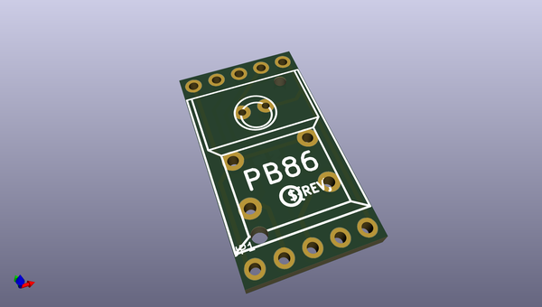
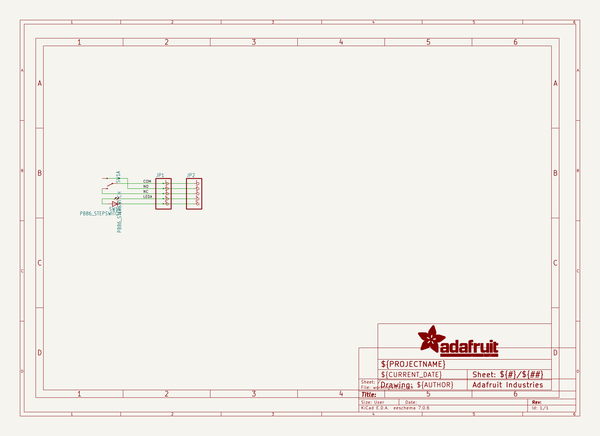
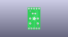
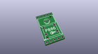
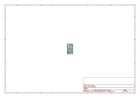
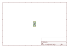
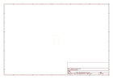
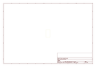
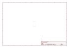

# OOMP Project  
## Adafruit-PB86-Breakout-PCB  by adafruit  
  
(snippet of original readme)  
  
-- Adafruit PB86 Step Switch Breakout-Friendly Breakout PCB  
  
<a href="http://www.adafruit.com/products/5631">   
Click here to purchase one from the Adafruit shop</a>  
  
PCB files for the Adafruit PB86 Step Switch Breakout-Friendly Breakout PCB.   
  
Format is EagleCAD schematic and board layout  
* https://www.adafruit.com/product/5631  
  
--- Description  
  
A couple of months ago we started carrying packs of colorful step switches reminiscent of the 16-step sequencer keys on TR-808 synthesizers. We gave folks the heads up that the switches are not breadboard or perf-board friendly i.e. would need to either be hand-wired or designed into a PCB.  
  
And then we heard LCD Soundsystem is coming back on tour - so we sold our guitars to buy turntables & got cracking on a break-apart panel of step-switches to evoke the spirit of electronic music and DIY venues.  
  
Each panel comes with 12 individual breakouts to solder up and assemble to your favorite breadboard, perf-board, etc. It's a ton easier than trying to get a drink order in at the club in Bushwick, you get an easy way to get started on a DIY synth project!  
  
Please note, each order comes with one sheet of assembled PCBs that can be broken apart - we include top and bottom railing bits to help keep it nice and flat during shipment.  
  
Does not include headers which you'll need if you're going to plug these into a breadboard  
  
--- License  
  
Adafruit invests time and resources providing this ope  
  full source readme at [readme_src.md](readme_src.md)  
  
source repo at: [https://github.com/adafruit/Adafruit-PB86-Breakout-PCB](https://github.com/adafruit/Adafruit-PB86-Breakout-PCB)  
## Board  
  
  
## Schematic  
  
  
  
[schematic pdf](working_schematic.pdf)  
## Images  
  
  
  
  
  
  
  
  
  
  
  
  
  
  
  
  
