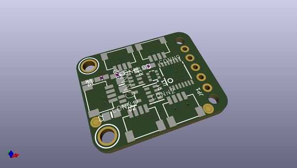
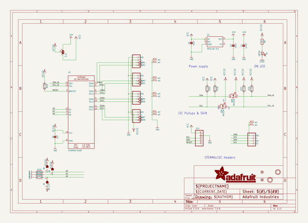
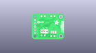
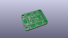
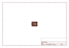
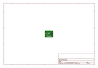
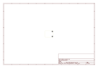
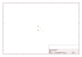
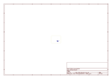
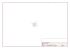

# OOMP Project  
## Adafruit-PCA9546-PCB  by adafruit  
  
(snippet of original readme)  
  
-- Adafruit PCA9546 4-Channel I2C Multiplexer PCB  
  
<a href="http://www.adafruit.com/products/5663">   
Click here to purchase one from the Adafruit shop</a>  
   
<a href="http://www.adafruit.com/products/5664">   
Click here to purchase one from the Adafruit shop</a>  
  
PCB files for the Adafruit PCA9546 4-Channel I2C Multiplexer and STEMMA QT / Qwiic PCA9546 Breakout.   
  
Format is EagleCAD schematic and board layout  
* https://www.adafruit.com/product/5663  
* https://www.adafruit.com/product/5664  
  
--- Description  
  
You just found the perfect I2C sensor, and you want to wire up two or three or more of them to your Arduino when you realize "Uh oh, this chip has a fixed I2C address, and from what I know about I2C, you cannot have two devices with the same address on the same SDA/SCL pins!" Are you out of luck? You would be if you didn't have this ultra-cool PCA9546 1-to-4 I2C multiplexer!  
  
Finally, a way to get up to 4 same-address I2C devices hooked up to one microcontroller - this multiplexer acts as a gatekeeper, shuttling the commands to the selected set of I2C pins with your command.  If you need to have up to 8 multiplexed devices, check out the 8-channel TCA9548 version of this board.  
  
Using it is fairly straight-forward: the multiplexer itself is on I2C address 0x70 (but can be adjusted from 0x70 to 0x77) and you simply write a single byte with the desired multiplexed ou  
  full source readme at [readme_src.md](readme_src.md)  
  
source repo at: [https://github.com/adafruit/Adafruit-PCA9546-PCB](https://github.com/adafruit/Adafruit-PCA9546-PCB)  
## Board  
  
  
## Schematic  
  
  
  
[schematic pdf](working_schematic.pdf)  
## Images  
  
  
  
  
  
  
  
  
  
  
  
  
  
  
  
  
