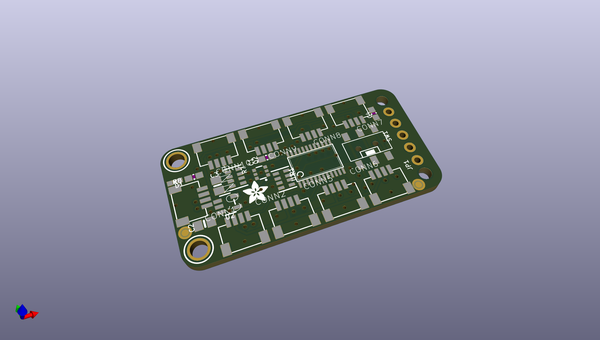
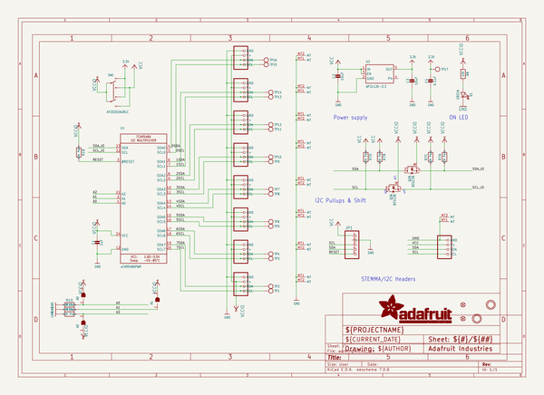
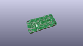
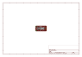
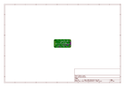
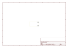
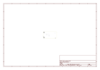
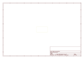
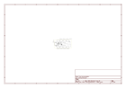

# OOMP Project  
## Adafruit-PCA9548-PCB  by adafruit  
  
(snippet of original readme)  
  
-- Adafruit PCA9548 8-Channel STEMMA QT I2C Multiplexer PCB  
  
<a href="http://www.adafruit.com/products/5626">   
Click here to purchase one from the Adafruit shop</a>  
  
PCB files for the Adafruit PCA9548 8-Channel STEMMA QT I2C Multiplexer.   
  
Format is EagleCAD schematic and board layout  
* https://www.adafruit.com/product/5626  
  
--- Description  
  
You just found the perfect I2C sensor, available in a handy chainable Qwiic, or STEMMA QT package, and you want to wire up two or three or more of them to your microcontroller when you realize "Uh oh, this chip has a fixed I2C address, and from what I know about I2C, you cannot have two devices with the same address on the same SDA/SCL pins!" Are you out of luck? You would be, if you didn't have this ultra-cool Adafruit PCA9548 8 Channel STEMMA QT / Qwiic I2C Multiplexer!  
  
Finally, a way to get up to 8 same-address I2C devices hooked up to one microcontroller - this multiplexer acts as a gatekeeper, shuttling the commands to the selected I2C port with your command.  
  
In case you're wondering why this uses the PCA9548A not the TCA9548A, the PCA9548 is the 'fraternal twin sister' of the TCA9548 but is easier to get during the great chip shortage of 2022. It works exactly the same, just can't go down to 1.8V power which is OK because QT boards are 3V or 5V only anyways. You can still use any example code or library for the TCA9548  
  
Using it is fairly straight-forward: the multiplexer itsel  
  full source readme at [readme_src.md](readme_src.md)  
  
source repo at: [https://github.com/adafruit/Adafruit-PCA9548-PCB](https://github.com/adafruit/Adafruit-PCA9548-PCB)  
## Board  
  
  
## Schematic  
  
  
  
[schematic pdf](working_schematic.pdf)  
## Images  
  
  
  
  
  
  
  
  
  
  
  
  
  
  
  
  
