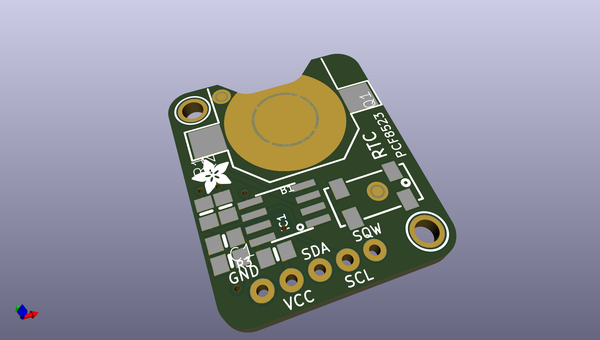
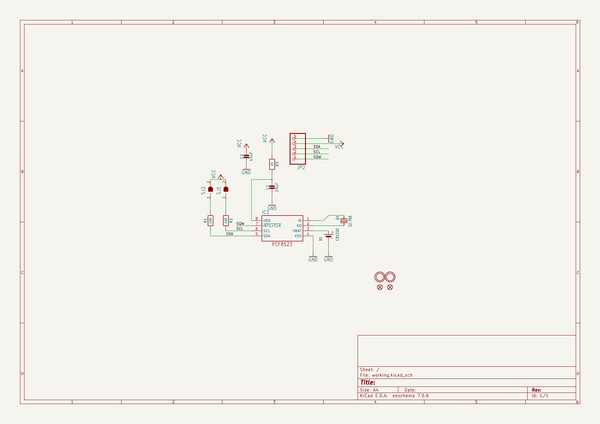
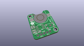
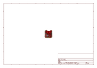
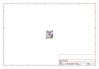
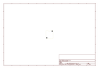
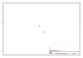
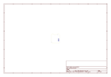
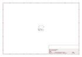

# OOMP Project  
## Adafruit-PCF8523-RTC-Breakout-PCB  by adafruit  
  
oomp key: oomp_projects_flat_adafruit_adafruit_pcf8523_rtc_breakout_pcb  
(snippet of original readme)  
  
-- Adafruit PCF8523 RTC Breakout PCB  
  
<a href="http://www.adafruit.com/products/5189">   
Click here to purchase one from the Adafruit shop</a>  
  
<a href="http://www.adafruit.com/products/3295">   
Click here to purchase one from the Adafruit shop</a>  
  
PCB files for the Adafruit PCF8523 RTC Breakout. Format is EagleCAD schematic and board layout  
  
For more details, check out the product pages at  
* https://www.adafruit.com/products/3295  
  
--- Description  
  
This is a great battery-backed real time clock (RTC) that allows your microcontroller project to keep track of time even if it is reprogrammed, or if the power is lost. Perfect for datalogging, clock-building, time stamping, timers and alarms, etc. Equipped with PCF8523 RTC - it can run from 3.3V or 5V power & logic!  
  
Works great with an Arduino using our RTC library, with CircuitPython or with a Raspberry Pi (or similar single board linux computer)  
  
* PCB & header are included  
* Plugs into any breadboard, or you can use wires  
* Two mounting holes  
* Will keep time for 5 years or more  
  
**Note: This product does not come with a CR1220 coin cell battery. We recommend you purchase a coin cell battery to use with this product.**  
  
The PCF8523 is simple and inexpensive but not a high precision device. It may lose or gain up to 2 seconds a day. For a high-precision, temperature compensated alternative, please check out the DS3231 pre  
  full source readme at [readme_src.md](readme_src.md)  
  
source repo at: [https://github.com/adafruit/Adafruit-PCF8523-RTC-Breakout-PCB](https://github.com/adafruit/Adafruit-PCF8523-RTC-Breakout-PCB)  
## Board  
  
  
## Schematic  
  
  
  
[schematic pdf](working_schematic.pdf)  
## Images  
  
  
  
  
  
  
  
  
  
  
  
  
  
  
  
  
