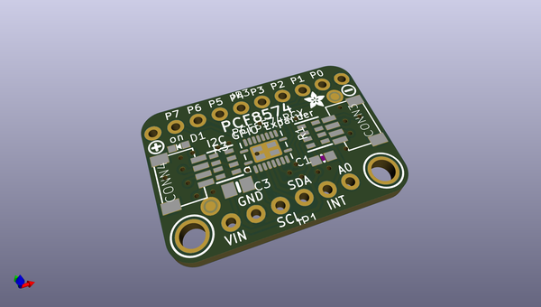
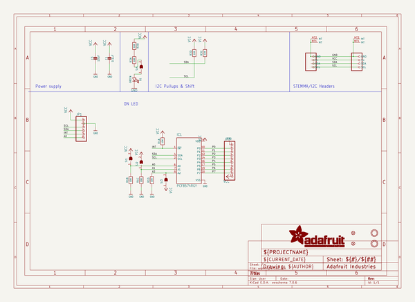
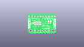
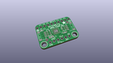
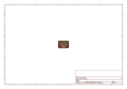
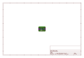
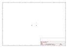
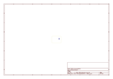
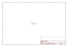

# OOMP Project  
## Adafruit-PCF8574-PCB  by adafruit  
  
(snippet of original readme)  
  
-- Adafruit PCF8574 I2C GPIO Expander Breakout - STEMMA QT / Qwiic PCB  
  
<a href="http://www.adafruit.com/products/5545">   
Click here to purchase one from the Adafruit shop</a>  
  
PCB files for the Adafruit PCF8574 I2C GPIO Expander Breakout - STEMMA QT / Qwiic.   
  
Format is EagleCAD schematic and board layout  
* https://www.adafruit.com/product/5545  
  
--- Description  
  
Expand your project possibilities, with the Adafruit PCF8574 GPIO Expander Breakout - an affordable 8 channel I2C expander.  
  
GPIO expanders work like this: you have a board with some number of GPIO but not enough for your project - maybe you need more buttons or LEDs. You could upgrade to a board with massive number of GPIO like the Grand Central, or you could pop on one of these boards. Connect it over I2C and then you can send/receive I2C commands to control the GPIO pins to write and read them. It's going to be slower than direct GPIO access, but maybe that doesn't matter if it takes a millisecond instead of a microsecond. You only need the two I2C pins, and you can even share the I2C port with other sensors and devices. Heck, you can even add more expanders for massive I/O control!  
  
The PCF8574 is a common, and slightly unusual I2C expander for folks who are used to the MCP230xx series:  
  
* First up, its very affordable - who doesn't love that?  
* It has 8 I/O pins  
* Three I2C address select jumpers mean up to 8 expanders to one bus for 64 total GPIO added  
* Eac  
  full source readme at [readme_src.md](readme_src.md)  
  
source repo at: [https://github.com/adafruit/Adafruit-PCF8574-PCB](https://github.com/adafruit/Adafruit-PCF8574-PCB)  
## Board  
  
  
## Schematic  
  
  
  
[schematic pdf](working_schematic.pdf)  
## Images  
  
  
  
  
  
  
  
  
  
  
  
  
  
  
  
  
