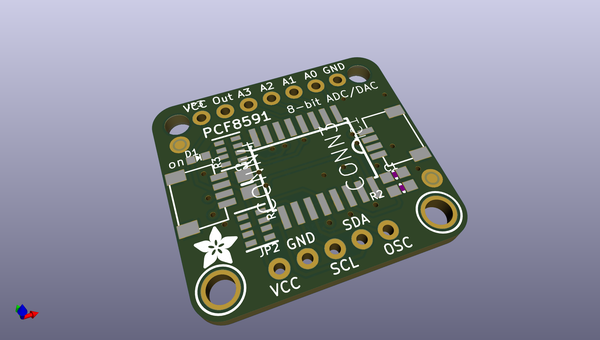
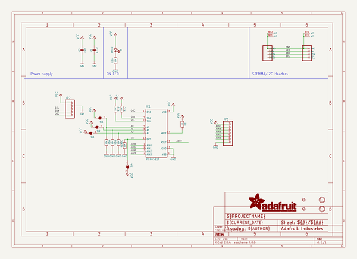
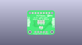
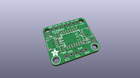
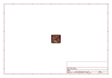
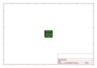
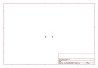
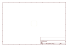
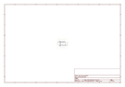

# OOMP Project  
## Adafruit-PCF8591-PCB  by adafruit  
  
oomp key: oomp_projects_flat_adafruit_adafruit_pcf8591_pcb  
(snippet of original readme)  
  
-- Adafruit PCF8591 ADC+DAC PCB  
  
<a href="http://www.adafruit.com/products/4648">   
Click here to purchase one from the Adafruit shop</a>  
  
PCB files for the Adafruit PCF8591 ADC+DAC.   
  
Format is EagleCAD schematic and board layout  
* https://www.adafruit.com/product/4648  
  
--- Description  
  
Measuring voltage and adjusting it is what electronics is all about so you won’t get far without friends like the PCF8591 ADC+DAC combo.  Analog to Digital Converters help by measuring an analog voltage and turning it into something a microcontroller like a Metro or Arduino   
can understand. If you’re using a single board computer like a Raspberry Pi, you might not have any other way to measure a voltage because even though they are well equipped for digital circuits, many boards of that type don’t have any pins that can measure analog voltages.   
Adding a PCF8591 to your electronics project will give you not one, not two but four analog inputs that you can use to measure voltages from. If knobs are just the thing to complete your project, just add a PCF8591 and some potentiometers and you’re ready to twist, turn, twiddle and tweak to get things just right  
  
Along with four 8-bit ADC channels, the PCF8591 comes complete with a Digital to Analog Converter converter as well! Not only can you measure voltages, but now you can create them just as you want them. You can even use the DAC and ADC together to create an input to a circuit and measure t  
  full source readme at [readme_src.md](readme_src.md)  
  
source repo at: [https://github.com/adafruit/Adafruit-PCF8591-PCB](https://github.com/adafruit/Adafruit-PCF8591-PCB)  
## Board  
  
  
## Schematic  
  
  
  
[schematic pdf](working_schematic.pdf)  
## Images  
  
  
  
  
  
  
  
  
  
  
  
  
  
  
  
  
