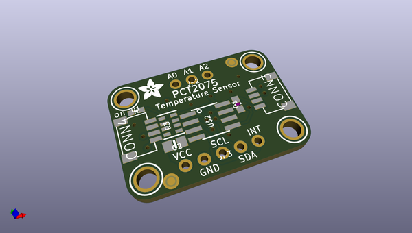
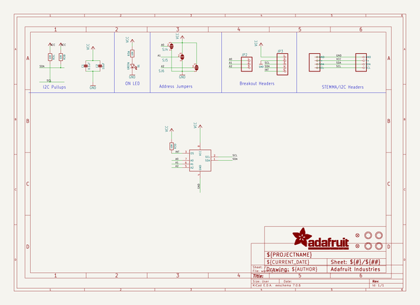
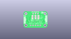
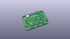
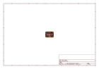
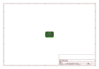
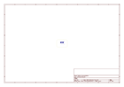
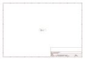

# OOMP Project  
## Adafruit-PCT2075-PCB  by adafruit  
  
(snippet of original readme)  
  
-- Adafruit PCT2075 Temperature Sensor PCB  
  
<a href="http://www.adafruit.com/products/4369">   
Click here to purchase one from the Adafruit shop</a>  
  
PCB files for the Adafruit PCT2075 Temperature Sensor.   
  
Format is EagleCAD schematic and board layout  
* https://www.adafruit.com/products/4369  
  
--- Description  
  
The PCT2075 by NXP is a pin compatible drop in replacement for a very common I2C temperature sensor, the LM75. Compared to the LM75 however, the 11-bit ADC in the PCT2075 provides more precise measurements when compared to the LM75's 9-bit ADC. Additionally because the PCT2075 allows the address pins to work in three states (high, low, floating), you can have 27 PCT2075s on the same bus as opposed to only 8 for the LM75. Now you can finally measure the temperature the individual temperatures of the tentacles of three octopuses instead of just one!  
  
Otherwise the two sensors are the same. The PCT2075 will report temperature and allow you to a set a high temperature threshold that the sensor will compare to the current temperature and raise an alert when the current temperature exceeds the threshold. There are also a few (metaphorical) knobs to twist to change the alerting and measurement behavior.  
  
As with all Adafruit breakouts, we've done the work to make this handy temperature helper super easy to use. We've put it on a breakout board with the required support circuitry and connectors to make it easy to work with, a  
  full source readme at [readme_src.md](readme_src.md)  
  
source repo at: [https://github.com/adafruit/Adafruit-PCT2075-PCB](https://github.com/adafruit/Adafruit-PCT2075-PCB)  
## Board  
  
  
## Schematic  
  
  
  
[schematic pdf](working_schematic.pdf)  
## Images  
  
  
  
  
  
  
  
  
  
  
  
  
  
  
  
  
