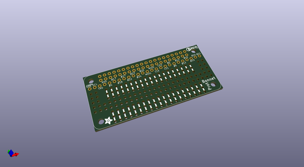
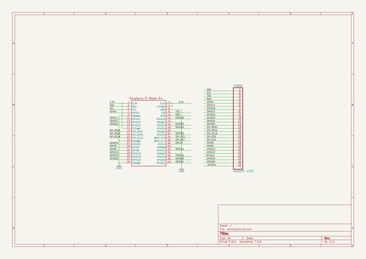
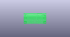
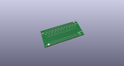
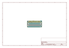
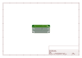
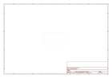
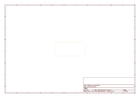
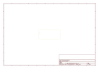

# OOMP Project  
## Adafruit-Perma-Proto-Bonnet-PCB  by adafruit  
  
(snippet of original readme)  
  
-- Adafruit Perma Proto Bonnet PCB  
  
<a href="http://www.adafruit.com/products/3203">   
Click here to purchase one from the Adafruit shop</a>  
  
PCB files for the Adafruit Perma Proto Bonnet for Raspberry Pi. Format is EagleCAD schematic and board layout  
* https://www.adafruit.com/products/3203  
  
--- Description  
  
Design your own Bonnet or pHAT, attach custom circuitry and otherwise dress your Pi Zero with this jaunty prototyping Bonnet kit!  
  
To add to the [Adafruit Bonnet party](https://www.adafruit.com/categories/929), we have this Perma-Proto inspired plug in daughter board. It has a grid of 0.1" prototyping soldering holes for attaching chips, resistors, LED, potentiometers and more. The holes are connected underneath with traces to mimic the solderless breadboards with which you're familiar. There's also long power strips for +3V, +5V and Ground connections to the Pi. Near the top we break out nearly every pin you could want to connect to the Pi (-26 didn't quite make the cut).  
  
The __Perma-Proto Bonnet__ comes with a printed circuit board and a single [2x20 GPIO Header for Raspberry Pi](http://www.adafruit.com/product/2222) to put your Perma-Proto on top of your Raspberry Pi Zero (like a nice little bonnet...). Unlike our [Perma-Proto HATs](https://www.adafruit.com/products/2314), this design does not include an EEPROM, so you can 'stack' it with other Bonnets and pHATs without worrying about an EEPROM address collision.  
  
  full source readme at [readme_src.md](readme_src.md)  
  
source repo at: [https://github.com/adafruit/Adafruit-Perma-Proto-Bonnet-PCB](https://github.com/adafruit/Adafruit-Perma-Proto-Bonnet-PCB)  
## Board  
  
  
## Schematic  
  
  
  
[schematic pdf](working_schematic.pdf)  
## Images  
  
  
  
  
  
  
  
  
  
  
  
  
  
  
  
  
