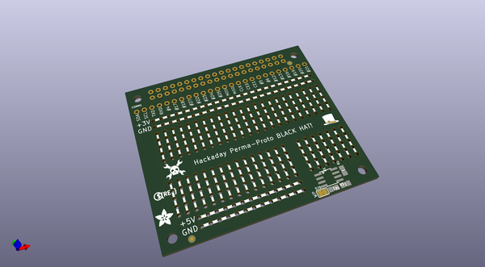
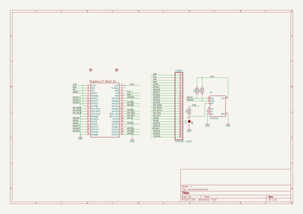
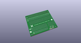
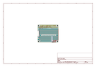
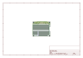
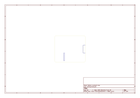
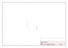
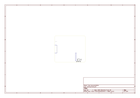

# OOMP Project  
## Adafruit-Perma-Proto-HAT-PCB  by adafruit  
  
oomp key: oomp_projects_flat_adafruit_adafruit_perma_proto_hat_pcb  
(snippet of original readme)  
  
- Adafruit Perma-Proto HAT for Raspberry Pi Computers  
  
&nbsp;    
Click to purchase from the Adafruit Shop:  
- [With EEPROM](https://www.adafruit.com/product/2314)  
- [Without EEPROM](https://www.adafruit.com/product/2310)  
  
PCB files for the Adafruit Perma-Proto HAT for Raspberry Pi Computers (all with the 40 pin header)  
  
Design your own Pi HAT, attach custom circuitry and otherwise dress your Pi Zero, A+, B+, Pi 2 or Pi 3 (any Pi with a 2x20 connector) with this jaunty prototyping HAT kit.  
  
To kick off the Adafruit HAT party, we have this Perma-Proto inspired plug in daughter board. It has a grid of 0.1" prototyping soldering holes for attaching chips, resistors, LED, potentiometers and more. The holes are connected underneath with traces to mimic the solderless breadboards with which you're familiar. There's also long power strips for +3V, +5V and Ground connections to the Pi. Near the top we break out nearly every pin you could want to connect to the Pi (-26 didn't quite make the cut).  
  
This is just the basic version of our Perma-Proto HAT.  It comes with a printed circuit board and a single 2x20 GPIO Header for Raspberry Pi to put your Perma-Proto on top of your Raspberry Pi (like a nice little hat...) This version does not come with an EEPROM so you can 'stack' it with   
  full source readme at [readme_src.md](readme_src.md)  
  
source repo at: [https://github.com/adafruit/Adafruit-Perma-Proto-HAT-PCB](https://github.com/adafruit/Adafruit-Perma-Proto-HAT-PCB)  
## Board  
  
  
## Schematic  
  
  
  
[schematic pdf](working_schematic.pdf)  
## Images  
  
  
  
  
  
  
  
  
  
  
  
  
  
  
  
  
