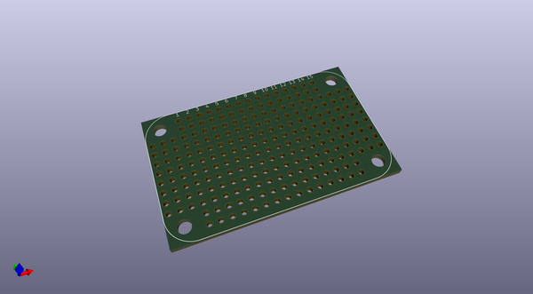
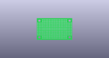
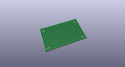
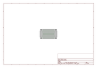
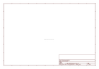

# OOMP Project  
## Adafruit-Perma-Proto-PCB  by adafruit  
  
oomp key: oomp_projects_flat_adafruit_adafruit_perma_proto_pcb  
(snippet of original readme)  
  
-- Perma-Proto Prototyping Board PCBs (5 sizes)  
  
&nbsp;   
   
&nbsp;   
    
    
Click the picture or the link below to purchase from the Adafruit shop  
  
PCB files for the Adafruit Perma Protos. Format is EagleCAD schematic and board layout   
  
Click to order the boards of your choice  
* Mint Tin Size: https://www.adafruit.com/product/723  
* Small Mint Tin Size: https://www.adafruit.com/product/1214  
* Quarter-sized: https://www.adafruit.com/product/1608  
* Half-sized: https://www.adafruit.com/product/1609  
* Full-sized: https://www.adafruit.com/product/1606  
  
--- Description  
  
Customers have asked us to carry basic perf-board, but we never liked the look of most basic perf: its always crummy quality, with pads that flake off and no labeling. Then we thought about how people actually prototype - usually starting with a solderless breadboard and then transferring the parts to a more permanent PCB. That's when we realized what people would really like is a proto board that makes it eas  
  full source readme at [readme_src.md](readme_src.md)  
  
source repo at: [https://github.com/adafruit/Adafruit-Perma-Proto-PCB](https://github.com/adafruit/Adafruit-Perma-Proto-PCB)  
## Board  
  
  
## Schematic  
  
  
  
[schematic pdf](working_schematic.pdf)  
## Images  
  
  
  
  
  
  
  
  
  
  
  
  
  
  
  
  
