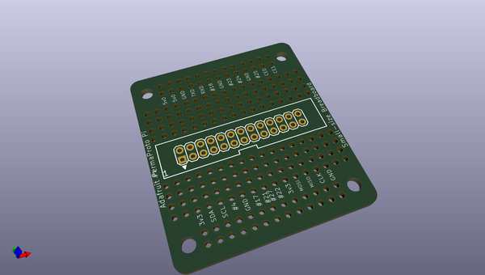
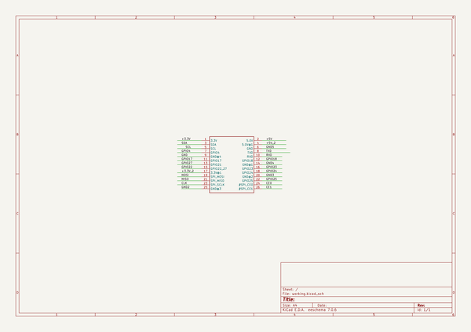
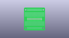
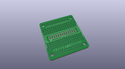
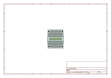
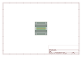
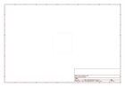
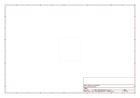
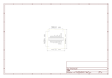

# OOMP Project  
## Adafruit-Perma-Proto-Pi-PCBs  by adafruit  
  
oomp key: oomp_projects_flat_adafruit_adafruit_perma_proto_pi_pcbs  
(snippet of original readme)  
  
-- Adafruit Perma Proto Pi PCBs  
  
&nbsp;   
&nbsp;   
   
Click the image or links below to go to a specific size board in the Adafruit shop.  
  
PCB files for the Adafruit Perma Proto Pi. Format is EagleCAD schematic and board layout  
* https://www.adafruit.com/products/1135  
* https://www.adafruit.com/products/1148  
* https://www.adafruit.com/products/1171  
  
We put a PermaProto full/half/quarter sized proto board in a blender with a Pi Cobbler and out emerged this very tasty confection - the PermaProto for Pi! It has the Cobbler baked right in. Simply solder the 2x13 pin header in and you get all the labeled breakouts with tons of prototyping space, power rails, mounting holes and that gorgeous silk.  
  
Customers have asked us to carry basic perf-board, but we never liked the look of most basic perf: its always crummy quality, with pads that flake off and no labeling. Then we thought about how people actually prototype - usually starting with a solderless breadboard and then transferring the parts to a more permanent PCB. That's when we realized what people would really like is a proto board that makes it easy!  
  
These proto-boards are the PCBs you always wish you had, but never realize  
  full source readme at [readme_src.md](readme_src.md)  
  
source repo at: [https://github.com/adafruit/Adafruit-Perma-Proto-Pi-PCBs](https://github.com/adafruit/Adafruit-Perma-Proto-Pi-PCBs)  
## Board  
  
  
## Schematic  
  
  
  
[schematic pdf](working_schematic.pdf)  
## Images  
  
  
  
  
  
  
  
  
  
  
  
  
  
  
  
  
