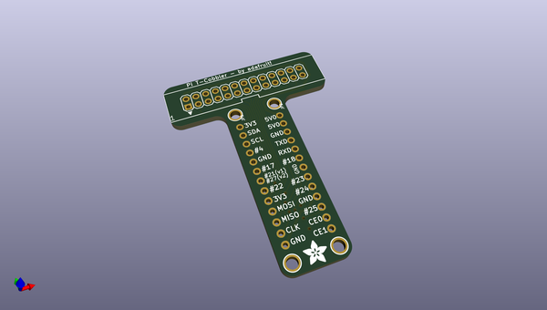
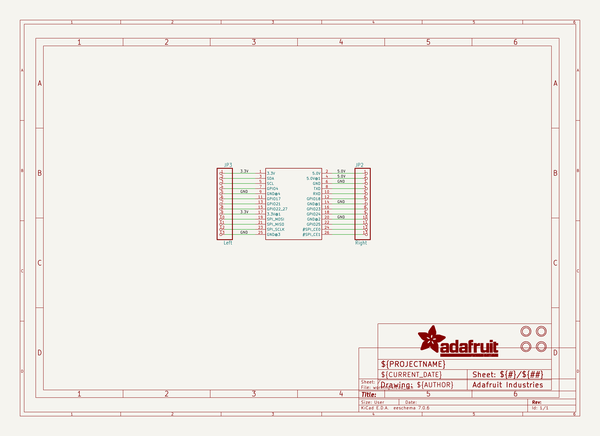
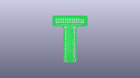
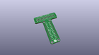
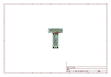
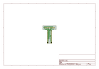
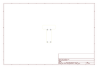
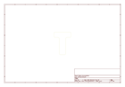
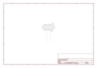

# OOMP Project  
## Adafruit-Pi-Cobber-PCBs  by adafruit  
  
oomp key: oomp_projects_flat_adafruit_adafruit_pi_cobber_pcbs  
(snippet of original readme)  
  
-- Adafruit Pi Cobber PCBs  
&nbsp;    
&nbsp;    
  
The Raspberry Pi B+/Pi 2/ Pi 3 has landed on the Maker World like a 20 or 40-GPIO pinned, quad-USB ported, credit card sized bomb of DIY joy. And while you can use most of our great Model B accessories by hooking up our downgrade cable, its probably a good time to upgrade your set up and accessorize using all of the Model B+'s / Pi 2's / Pi 3's 40 pins.  
  
That's why we now carry the Adafruit Assembled Pi Cobbler Plus - Breakout and Cable for Raspberry Pi A+, B+, Pi 2 and Pi 3. It's an add on prototyping Pi Cobbler from Adafruit specifically designed for the B+ and Pi 2 that you can break out all those tasty power, GPIO, I2C and SPI pins from the 40-pin header onto a solderless breadboard. This will make "cobbling together" prototypes with the Pi super easy.  
  
Designed for use with Raspberry Pi Model A+/B+/Pi 2/Pi 3 only! No soldering required!  
  
This Cobbler is in a compact shape, which is the least bulky way to wire up. The cable plugs between the Pi A+/B+/Pi 2/Pi 3 computer and the Cobbler breakout. The Cobbler can plug int  
  full source readme at [readme_src.md](readme_src.md)  
  
source repo at: [https://github.com/adafruit/Adafruit-Pi-Cobber-PCBs](https://github.com/adafruit/Adafruit-Pi-Cobber-PCBs)  
## Board  
  
  
## Schematic  
  
  
  
[schematic pdf](working_schematic.pdf)  
## Images  
  
  
  
  
  
  
  
  
  
  
  
  
  
  
  
  
