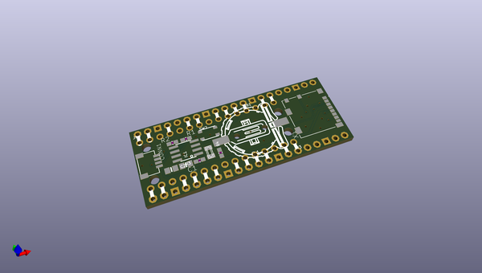
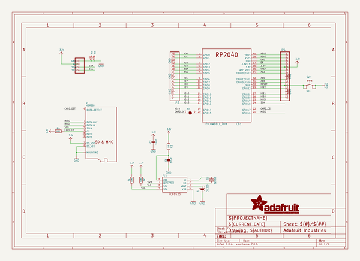
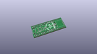
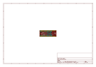
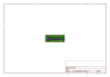
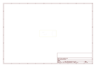
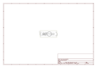

# OOMP Project  
## Adafruit-PiCowbell-Adalogger-PCB  by adafruit  
  
(snippet of original readme)  
  
-- Adafruit PiCowbell Adalogger for Pico - MicroSD, RTC & STEMMA QT PCB  
  
<a href="http://www.adafruit.com/products/5703">   
Click here to purchase one from the Adafruit shop</a>  
  
PCB files for the Adafruit PiCowbell Adalogger for Pico - MicroSD, RTC & STEMMA QT.   
  
Format is EagleCAD schematic and board layout  
* https://www.adafruit.com/product/5703  
  
--- Description  
  
Ding dong! Hear that? It's the PiCowbell ringing, letting you know that the new Adafruit PiCowbell Adalogger is in stock and ready to assist your Raspberry Pi Pico and Pico W project with handy hardware and datalogging.  
  
The PiCowbell Adalogger is the same size and shape as a Pico and is intended to socket underneath to make your next data logging or data reading project super easy. Micro SD card socket? Yes! STEMMA QT / Qwiic connector for fast I2C? Indeed. Real Time Clock with battery backup for accurate timekeeping? Of course!  
  
Please Note! There are a lot of possible configurations, and we stock various headers depending on how you want to solder and attach. Especially if you want the Pico on top so that the BOOTSEL button and LED are accessible.  
  
1. Use the Pico Stacking Headers if you want to be able to plug into a breadboard or other accessory with sockets.  
2. Use the Pico Socket Headers if you want to plug directly in and have a nice solid connection that doesn't have any poking-out-bits.  
3. Use the Short Socket Headers for a very slim but pluggable d  
  full source readme at [readme_src.md](readme_src.md)  
  
source repo at: [https://github.com/adafruit/Adafruit-PiCowbell-Adalogger-PCB](https://github.com/adafruit/Adafruit-PiCowbell-Adalogger-PCB)  
## Board  
  
  
## Schematic  
  
  
  
[schematic pdf](working_schematic.pdf)  
## Images  
  
  
  
  
  
  
  
  
  
  
  
  
  
  
  
  
