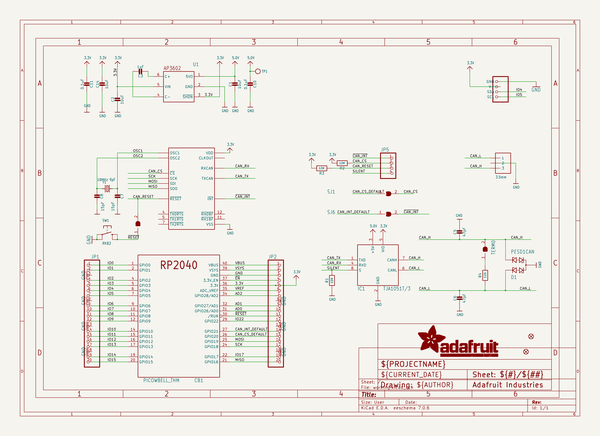
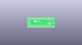
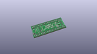
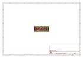
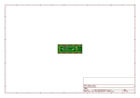
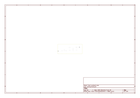
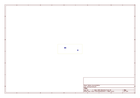
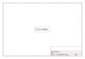

# OOMP Project  
## Adafruit-PiCowbell-CAN-Bus-PCB  by adafruit  
  
oomp key: oomp_projects_flat_adafruit_adafruit_picowbell_can_bus_pcb  
(snippet of original readme)  
  
-- Adafruit PiCowbell CAN Bus for Pico - MCP2515 CAN Controller PCB  
  
<a href="http://www.adafruit.com/products/5728">   
Click here to purchase one from the Adafruit shop</a>  
  
PCB files for the Adafruit PiCowbell CAN Bus for Pico - MCP2515 CAN Controller.   
  
Format is EagleCAD schematic and board layout  
* https://www.adafruit.com/product/5728  
  
--- Description  
  
Ding dong! Hear that? It's the PiCowbell ringing, letting you know that the new Adafruit PiCowbell CAN Bus is in stock and ready to assist your Raspberry Pi Pico and Pico W project connect to CAN bus networks for automotive or robotics projects.  
  
CAN Bus is a small-scale networking standard, originally designed for cars and, yes, busses, but is now used for many robotics or sensor networks that need better range and addressing than I2C and don't have the pins or computational ability to talk on Ethernet. CAN is 2 wire differential, which means it's good for long distances and noisy environments.  
  
Messages are sent at about 1Mbps rate - you set the frequency for the bus and then all 'joiners' must match it, and have an address before the packet so that each node can listen in to messages just for it. New nodes can be attached easily because they just need to connect to the two data lines anywhere in the shared net. Each CAN device sends messages whenever it wants, and thanks to some clever data encoding, can detect if there's a message collision and retransmit later.   
  
I  
  full source readme at [readme_src.md](readme_src.md)  
  
source repo at: [https://github.com/adafruit/Adafruit-PiCowbell-CAN-Bus-PCB](https://github.com/adafruit/Adafruit-PiCowbell-CAN-Bus-PCB)  
## Board  
  
  
## Schematic  
  
  
  
[schematic pdf](working_schematic.pdf)  
## Images  
  
  
  
  
  
  
  
  
  
  
  
  
  
  
  
  
