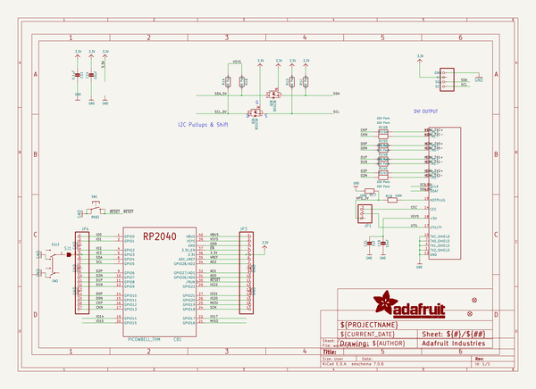

# OOMP Project  
## Adafruit-PiCowbell-DVI-Output  by adafruit  
  
(snippet of original readme)  
  
-- Adafruit PiCowbell DVI Output for Pico - Works with HDMI Display PCB  
  
<a href="http://www.adafruit.com/products/5745">   
Click here to purchase one from the Adafruit shop</a>  
  
PCB files for the Adafruit PiCowbell DVI Output for Pico - Works with HDMI Display.   
  
Format is EagleCAD schematic and board layout  
* https://www.adafruit.com/product/5745  
  
--- Description  
  
Ding dong! Hear that? It's the PiCowbell ringing, letting you know that the new Adafruit PiCowbell DVI Output for Pico is in stock and ready to display images and graphics from a microcontroller directly to an HDMI monitor or television! Note it doesn't do audio, just graphics.  
  
The PiCowbell DVI is the same size and shape as a Pico and is intended to socket underneath to make your next video output project super easy. Mini HDMI connector for use with standard HDMI cables? Yes! STEMMA QT / Qwiic connector for fast I2C? Indeed. Reset button & extra switch for restarting code or changing configuration? Bien sur.  
  
The PiCowbell DVI provides you with:  
  
* Right angle JST SH connector for I2C / Stemma QT / Qwiic connection. Provides 3V, GND, IO4 (SDA), and IO5 (SCL). Also connected through to the HDMI sink (monitor) with level shifting, so the EDID can be read.  
* Mini HDMI connector for DVI output to any HDMI display or monitor.  
	* GPIO6: D2+  
	* GPIO7: D2-  
	* GPIO8: D1+  
	* GPIO9: D1-  
	* GPIO10: D0+  
	* GPIO11: D0-  
	* GPIO12: Clock +  
	* GPIO13: Clock -  
* Pin breakout fo  
  full source readme at [readme_src.md](readme_src.md)  
  
source repo at: [https://github.com/adafruit/Adafruit-PiCowbell-DVI-Output](https://github.com/adafruit/Adafruit-PiCowbell-DVI-Output)  
## Board  
  
  
## Schematic  
  
  
  
[schematic pdf](working_schematic.pdf)  
## Images  
  
  
  
  
  
  
  
  
  
  
  
  
  
  
  
  
