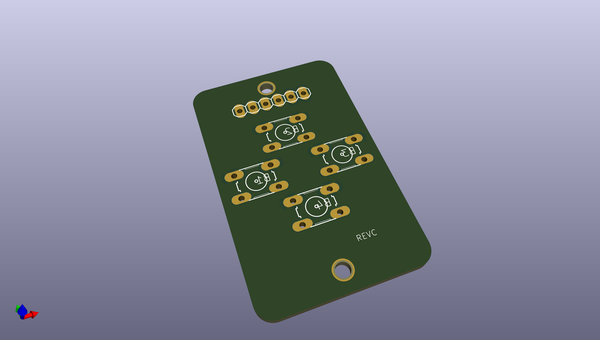
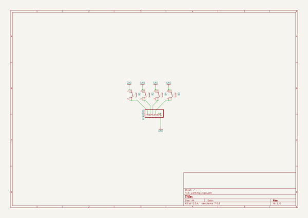
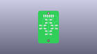
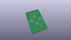
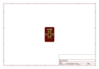
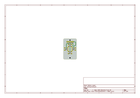
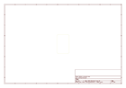
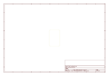
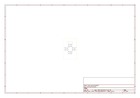

# OOMP Project  
## Adafruit-PiGRRL-PCB  by adafruit  
  
oomp key: oomp_projects_flat_adafruit_adafruit_pigrrl_pcb  
(snippet of original readme)  
  
-- Adafruit PiGRRL PCBs  
  
<a href="http://www.adafruit.com/products/3015">&nbsp;   
<a href="http://www.adafruit.com/products/2934">   
Click a picture to purchase from the Adafruit shop</a>  
  
PCB files for the PiGrrl Gamepads. Format is EagleCAD schematic and board layout  
  
For more details, check out the product pages at  
  * PiGRRL 2.0 Custom Gamepad PCB http://www.adafruit.com/products/3015  
  * PiGrrl Zero Custom Gamepad PCB http://www.adafruit.com/products/2934  
  
--- Description  
  
**PiGrrl 2:** This is the Custom Gamepad PCB for the PiGRRL 2 pack! The board is designed for use in portable gaming projects like the PiGRRL 2 but it's basically everything-you-need to make your very own DIY gaming project with GPIO input  
  
We've dramatically cut the build time in half of the PiGRRL 2 pack by making this custom gamepad PCB. Just solder in 6mm tactile switch buttons and an 2x20 header or IDC box header to the gamepad PCB - No more tedious button wiring!  
  
Comes with just the PCB! Best for people who already have the rest of the parts, or are doing a custom build.  
  
**PiGrrl Zero:** This is the custom Gamepad PCB for the PiGRRL Zero Parts Kit!   
  
We've dramatically cut the build time in half of the PiGRRL Zero pack by making this custom gamepad PCB. Just solder in 6mm tactile switch buttons and do a some wiring from the header pins on the PCB.  
  
Comes with just a single PCB and you'll need 2  
  full source readme at [readme_src.md](readme_src.md)  
  
source repo at: [https://github.com/adafruit/Adafruit-PiGRRL-PCB](https://github.com/adafruit/Adafruit-PiGRRL-PCB)  
## Board  
  
  
## Schematic  
  
  
  
[schematic pdf](working_schematic.pdf)  
## Images  
  
  
  
  
  
  
  
  
  
  
  
  
  
  
  
  
