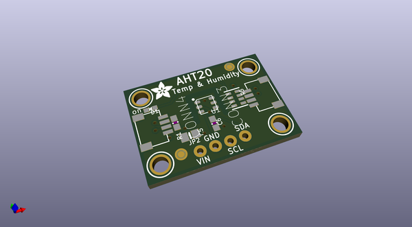

# OOMP Project  
## Adafruit_Pinguin  by adafruit  
  
oomp key: oomp_projects_flat_adafruit_adafruit_pinguin  
(snippet of original readme)  
  
- Adafruit_Pinguin  
An EAGLE silkscreen label generator written in Python (using PIL/Pillow)  
allowing nicer fonts, because EAGLE's proportional font doesn't get output  
in CAM data, and the new vector font isn't very attractive.  
  
Ingests an EAGLE .brd file, looking for text elements on layers 20 and  
21 (top, bottom) and produces raster equivalents on layers 170 and 171.  
When producing CAM files, the raster output layers should then be included  
along with the normal top and bottom silk layers. The original text elements  
are moved to backup layers (172 and 173) if they need to be recovered later.  
This is just for text; any other silk should go on the normal layers used  
for such things, and are not rasterized by this tool.  
  
Inspired a bit by SparkFun's "Buzzard" project, but wanting something more  
automated.  
  
Name is a cheesy portmanteau of "pin" (because that's mostly what's getting  
labeled) and "penguin" (keeping with the bird naming motif; EAGLE, Buzzard,  
etc.). I *detest* portmanteau software names but here we are.  
  
"fonts" folder contains TrueType fonts: Google Arimo (EAGLE's proportional  
font) and GNU FreeFont files as a starting point. THESE FONTS HAVE THEIR OWN  
LICENSES INDEPENDENT FROM THE CODE, see notes in corresponding  
subdirectories. If adding any font(s), CHECK for permissive license and  
INCLUDE the license file; don't just add things wantonly! fonts.google.com  
has some great-looking designs with a permissive license.  
  
--- Use  
  
`python pinguin.py filename.brd`  
  
Outpu  
  full source readme at [readme_src.md](readme_src.md)  
  
source repo at: [https://github.com/adafruit/Adafruit_Pinguin](https://github.com/adafruit/Adafruit_Pinguin)  
## Board  
  
  
## Schematic  
  
  
  
[schematic pdf](working_schematic.pdf)  
## Images  
