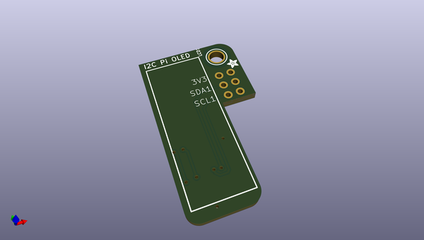
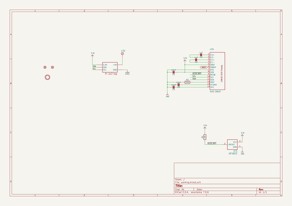
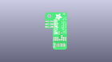
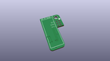
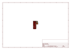
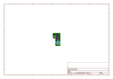
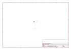
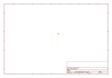
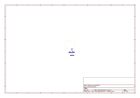
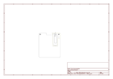

# OOMP Project  
## Adafruit-PiOLED-128x32-PCB  by adafruit  
  
(snippet of original readme)  
  
-- Adafruit PiOLED 128x32 PCB  
  
<a href="http://www.adafruit.com/products/3527">   
Click here to purchase one from the Adafruit shop</a>  
  
PCB files for the Adafruit PiOLED 128x32. Format is EagleCAD schematic and board layout  
* http://www.adafruit.com/product/3527  
  
--- Description  
  
If you're looking for the most compact li'l display for a Raspberry Pi (most likely a Pi Zero) project, this might be just the thing you need!  
  
The Adafruit 128x32 PiOLED is your little OLED pal, ready to snap onto any and all Raspberry Pi computers, to give you a little display. The PiOLED comes with a monochrome 128x32 OLED, with sharp white pixels. The OLED uses only the I2C pins so you have plenty of GPIO connections available for buttons, LEDs, sensors, etc. It's also nice and compact so it will fit into any case.  
  
These displays are small, only about 1" diagonal, but very readable due to the high contrast of an OLED display. This screen is made of 128x32 individual white OLED pixels and because the display makes its own light, no backlight is required. This reduces the power required to run the OLED and is why the display has such high contrast; we really like this miniature display for its crispness!  
  
Using the display is very easy, we have a Python library for the SSD1306 chipset. Our example code allows you to draw images, text, whatever you like, using the Python imaging library. Our tests showed 30 FPS update rates so you can do animat  
  full source readme at [readme_src.md](readme_src.md)  
  
source repo at: [https://github.com/adafruit/Adafruit-PiOLED-128x32-PCB](https://github.com/adafruit/Adafruit-PiOLED-128x32-PCB)  
## Board  
  
  
## Schematic  
  
  
  
[schematic pdf](working_schematic.pdf)  
## Images  
  
  
  
  
  
  
  
  
  
  
  
  
  
  
  
  
