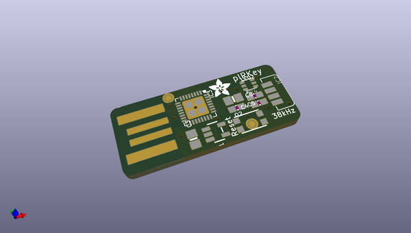
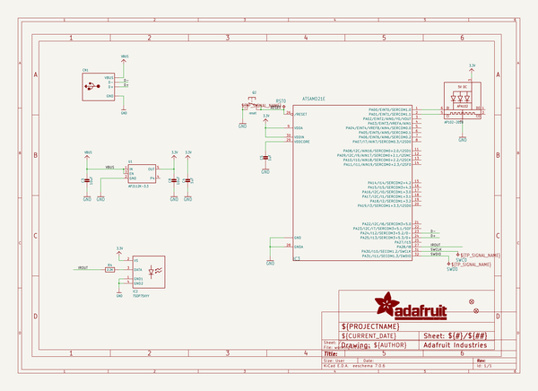
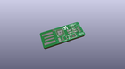
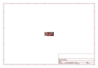
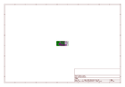
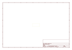
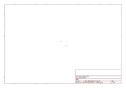
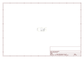

# OOMP Project  
## Adafruit-pIRKey-PCB  by adafruit  
  
(snippet of original readme)  
  
-- Adafruit pIRKey PCB  
  
<a href="http://www.adafruit.com/products/3364">   
Click here to purchase one from the Adafruit shop</a>  
  
PCB files for the Adafruit pIRKey. Format is EagleCAD schematic and board layout  
  
For more details, check out the product pages at  
* https://www.adafruit.com/product/3364  
  
--- Description  
  
The pIRkey adds an IR remote receiver to any computer, laptop, tablet...any computer or device with a USB port that can use a keyboard. This little board slides into any USB A port, and shows up as an every-day USB keyboard. The onboard ATSAMD21 microcontroller listens for IR remote signals and converts them to keypresses, mouse movements, or even USB serial output.  
  
**Coming soon! We want to reprogram our stock with the newest CircuitPython version before shipping these out.**  
  
Infrared is our favorite wireless protocol - no antennas, certifications, pairings, passwords, or special tools required. Works everywhere in the world and very intuitive - everyone's got an IR remote in their home!  Our original IRkey was a small USB-pluggable microcontroller board with an IR receiver, an Attiny85 microcontroller and indicator LED. When certain remote control commands were received, the IRkey would send corresponding keyboard presses. It was great, but was not easy to customize - you had to use the remote we sold it with.  
  
The pIRkey is an improvement on our original IRkey product, by adding a p for python. Now that w  
  full source readme at [readme_src.md](readme_src.md)  
  
source repo at: [https://github.com/adafruit/Adafruit-pIRKey-PCB](https://github.com/adafruit/Adafruit-pIRKey-PCB)  
## Board  
  
  
## Schematic  
  
  
  
[schematic pdf](working_schematic.pdf)  
## Images  
  
  
  
  
  
  
  
  
  
  
  
  
  
  
  
  
