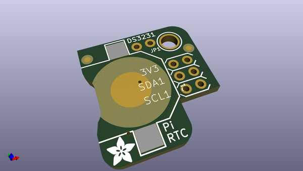
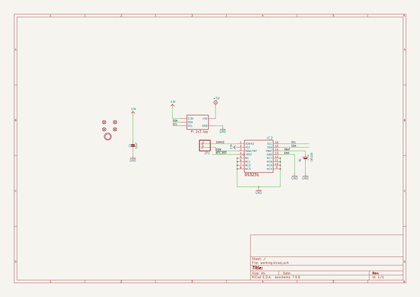
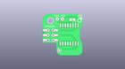
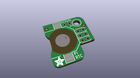
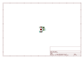
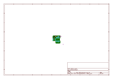
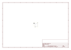
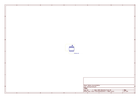
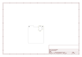

# OOMP Project  
## Adafruit-PiRTC-DS3231-PCB  by adafruit  
  
oomp key: oomp_projects_flat_adafruit_adafruit_pirtc_ds3231_pcb  
(snippet of original readme)  
  
-- Adafruit PiRTC Precise DS3231 Real Time Clock for Raspberry Pi PCB  
  
<a href="http://www.adafruit.com/products/4282">   
Click here to purchase one from the Adafruit shop</a>  
  
PCB files for the Adafruit PiRTC Precise DS3231 Real Time Clock for Raspberry Pi.   
  
Format is EagleCAD schematic and board layout  
* https://www.adafruit.com/product/4282  
  
--- Description  
  
This is the best battery-backed real time clock (RTC) you can get that allows your Raspberry Pi project to keep track of time if the power is lost. Perfect for data-logging, clock-building, NTP servers, time-stamping, timers and alarms, etc. Equipped with a genuine DS3231 RTC, it works great with the Raspberry Pi and has native kernel support.  
  
The datasheet for the DS3231 explains that this part is an "Extremely Accurate I²C-Integrated RTC/TCXO/Crystal". And, hey, it does exactly what it says on the tin! This Real Time Clock (RTC) is the most precise you can get in a small, low power package.  
  
Most RTCs use an external 32kHz timing crystal that is used to keep time with low current draw. And that's all well and good, but those crystals have slight drift, particularly when the temperature changes (the temperature changes the oscillation frequency very very very slightly but it does add up!) This RTC is in a beefy package because the crystal is inside the chip! And right next to the integrated crystal is a temperature sensor. That sensor compensates for the frequency  
  full source readme at [readme_src.md](readme_src.md)  
  
source repo at: [https://github.com/adafruit/Adafruit-PiRTC-DS3231-PCB](https://github.com/adafruit/Adafruit-PiRTC-DS3231-PCB)  
## Board  
  
  
## Schematic  
  
  
  
[schematic pdf](working_schematic.pdf)  
## Images  
  
  
  
  
  
  
  
  
  
  
  
  
  
  
  
  
