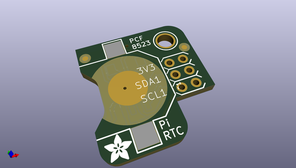
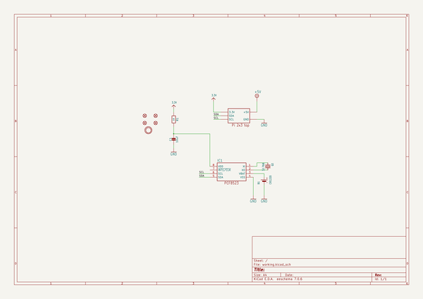
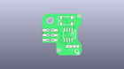
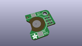
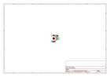
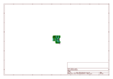
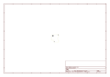
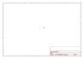
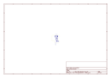
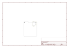

# OOMP Project  
## Adafruit-PiRTC-RTC-for-Raspberry-Pi-PCB  by adafruit  
  
oomp key: oomp_projects_flat_adafruit_adafruit_pirtc_rtc_for_raspberry_pi_pcb  
(snippet of original readme)  
  
-- Adafruit PiRTC RTC for Raspberry Pi PCB  
  
<a href="http://www.adafruit.com/products/3386">   
Click here to purchase one from the Adafruit shop</a>  
  
PCB files for the Adafruit PiRTC RTC for Raspberry Pi. Format is EagleCAD schematic and board layout  
  
For more details, check out the product page at  
* http://www.adafruit.com/product/3386  
  
--- Description  
  
This is a great battery-backed real time clock (RTC) that allows your Raspberry Pi project to keep track of time if the power is lost. Perfect for data-logging, clock-building, time-stamping, timers and alarms, etc. Equipped with PCF8523 RTC, it works great with the Raspberry Pi and has native kernel support.  
  
Works perfectly with any Raspberry Pi (or similar single board linux computer) including the Pi 1, Pi 2, Pi 3, Pi Zero, A+, B+ etc.  
  
Fully assembled & tested PCB plugs directly into your Pi's GPIO pins - No soldering required!  
Will keep time for 5 years or more  
  
**Note: This product does not come with a CR1220 coin cell battery.**  
  
--- License  
  
Adafruit invests time and resources providing this open source design, please support Adafruit and open-source hardware by purchasing products from [Adafruit](https://www.adafruit.com)!  
  
Designed by Limor Fried/Ladyada for Adafruit Industries.  
  
Creative Commons Attribution/Share-Alike, all text above must be included in any redistribution. See license.txt for additional details.  
  
  full source readme at [readme_src.md](readme_src.md)  
  
source repo at: [https://github.com/adafruit/Adafruit-PiRTC-RTC-for-Raspberry-Pi-PCB](https://github.com/adafruit/Adafruit-PiRTC-RTC-for-Raspberry-Pi-PCB)  
## Board  
  
  
## Schematic  
  
  
  
[schematic pdf](working_schematic.pdf)  
## Images  
  
  
  
  
  
  
  
  
  
  
  
  
  
  
  
  
