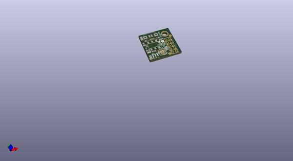
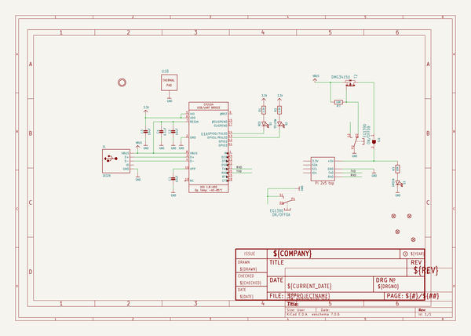
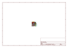
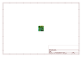
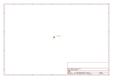
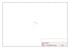
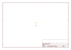
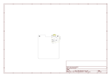

# OOMP Project  
## Adafruit-PiUART-PCB  by adafruit  
  
(snippet of original readme)  
  
-- Adafruit PiUART PCB  
  
<a href="http://www.adafruit.com/products/3589">   
Click here to purchase one from the Adafruit shop</a>  
  
PCB files for the Adafruit PiUART PCB. Format is EagleCAD schematic and board layout  
  
For more details, check out the product page at  
* http://www.adafruit.com/product/3589  
  
--- Description  
  
Here's another super handy add-on for your Raspberry Pi computer, perfect for 'head-less' setups! The PiUART adds a USB Type-C to serial connection so you can use any serial port software to connect to the Pi's console. It plugs in and is fast and easy to add whenever you need to connect to your Pi. Two LEDs connect to RX and TX on the serial converter chip so you get blinking whenever data is sent or received..  
  
We had some space left over, so the PiUART also comes with an on-off switch with a 4 Amp transistor. You can power your Pi through the USB-C port and then use the switch whenever you want to cut power, without having to unplug the cable. Low-power usage Pi's like the Pi Zero and A+ can thus be powered and controlled from a single cable connected to your computer. Heavy-hitter Pi's like the Pi 2 and Pi 3 may draw too much power from a computer USB port, so check if your motherboard has a high-current USB port before trying.  
  
Comes fully assembled and ready to go, plug into your Pi, and on Mac OS X install the driver - within 2 minutes and you'll be ready to go.  
  
Works with any Raspberry Pi computer (P  
  full source readme at [readme_src.md](readme_src.md)  
  
source repo at: [https://github.com/adafruit/Adafruit-PiUART-PCB](https://github.com/adafruit/Adafruit-PiUART-PCB)  
## Board  
  
  
## Schematic  
  
  
  
[schematic pdf](working_schematic.pdf)  
## Images  
  
  
  
  
  
  
  
  
  
  
  
  
  
  
  
  
