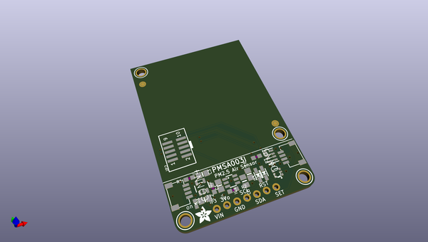
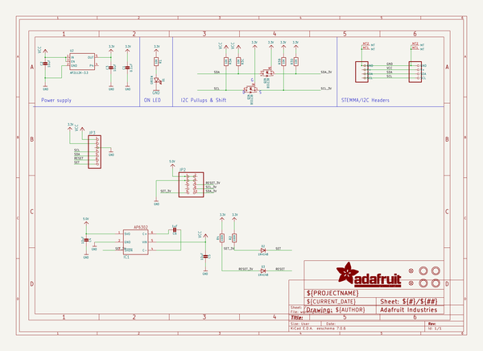
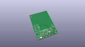
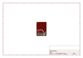
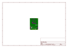
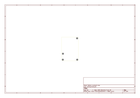
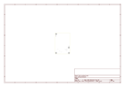
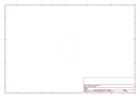
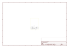

# OOMP Project  
## Adafruit-PMSA003I-PCB  by adafruit  
  
(snippet of original readme)  
  
-- Adafruit PMSA003I Air Quality Breakout - STEMMA QT / Qwiic PCB  
  
<a href="http://www.adafruit.com/products/4632">   
Click here to purchase one from the Adafruit shop</a>  
  
PCB files for the Adafruit PMSA003I Air Quality Breakout - STEMMA QT / Qwiic.  
  
Format is EagleCAD schematic and board layout  
* https://www.adafruit.com/product/4632  
  
--- Description  
  
Breathe easy, knowing that you can track and sense the quality of the air around you with this Adafruit PMSA003I Air Quality Breakout. This sensor is great for monitoring air quality, in a compact plug-in format.  
  
Best of all, unlike almost all other sensors we've seen that are UART interface, this one is I2C interface, which makes it a great match for single board Linux computers like Raspberry Pi, or even plain Arduino UNO's that normally would use software serial.  
  
If you're an I2C fan (who isn't?), we've included two of our handy dandy SparkFun Qwiic compatible STEMMA QT connectors for the I2C bus so you don't even need to solder! Plug and play with other 'QT boards and sensors to add quick air quality sensing.  
  
This sensor uses laser scattering to radiate suspending particles in the air, then collects scattering light to obtain the curve of scattering light change with time. The microprocessor calculates equivalent particle diameter and the number of particles with different diameters per unit volume.  
  
The I2C data stream updates once per second, you'll get:  
  
* PM1.0, P  
  full source readme at [readme_src.md](readme_src.md)  
  
source repo at: [https://github.com/adafruit/Adafruit-PMSA003I-PCB](https://github.com/adafruit/Adafruit-PMSA003I-PCB)  
## Board  
  
  
## Schematic  
  
  
  
[schematic pdf](working_schematic.pdf)  
## Images  
  
  
  
  
  
  
  
  
  
  
  
  
  
  
  
  
